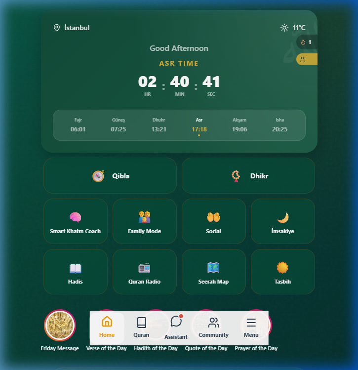
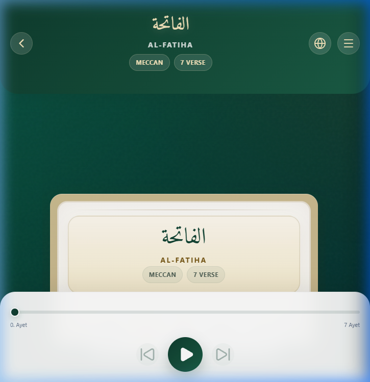
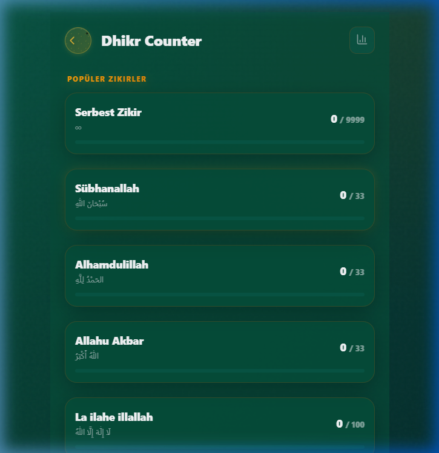

# Huzur - Modern Islamic Lifestyle & Productivity App

<p align="center">
  
</p>

<p align="center">
  
  
  
  
  
  
</p>

---

Huzur is an offline-first productivity application designed to help modern Muslims track their daily religious duties, learn the Holy Quran, and maintain their spiritual growth.

Built with React, Vite, and Capacitor, this application provides a seamless experience across both web and mobile platforms.

## ✨ Core Features

<p align="center">
  
  
  
</p>

- 🕌 **Smart Prayer Times**: Precise location-based times and customizable notifications.
- 📖 **Holy Quran**: 114 Surahs, interactive reading modes, and translation support.
- 🤲 **Dua and Dhikr**: Extensive prayer library and digital tasbih counter.
- 🧭 **Qibla Compass**: Accurate sensor-supported Qibla direction finder.
- 📊 **Worship Tracking**: Statistical tracking for missed prayers and daily goals.
- 🌦️ **Spiritual Weather**: Daily motivation with Asma-ul Husna, Ayah of the day, and Hadiths.
- 📱 **Modern Interface**: Eye-friendly, premium design with an Emerald and Gold theme.

## 🛠️ Tech Stack

Huzur is built on the most current and performant technologies:

- **Frontend**: [React 19](https://reactjs.org/) + [Vite 7](https://vitejs.dev/)
- **Mobile Bridge**: [Capacitor 7](https://capacitorjs.com/)
- **Iconography**: [Lucide React](https://lucide.dev/)
- **State Management**: Hooks and Context API (Strict Mode compatible)
- **Services**: Firebase (Optional), RevenueCat (Subscriptions)
- **Styling**: Modern Vanilla CSS (Premium designs and micro-animations)

## 🚀 Getting Started

### Prerequisites

- **Node.js**: v22.x (LTS) or higher
- **npm** or **yarn**
- **Android Studio**: Required for building Android applications.

### Installation

1. **Clone the repository:**
   ```bash
   git clone https://github.com/canburakyol/Huzur.git
   cd Huzur
   ```

2. **Install dependencies:**
   ```bash
   npm install
   ```

3. **Run in development mode:**
   ```bash
   npm run dev
   ```

4. **Create a production build:**
   ```bash
   npm run build
   ```

5. **Test on Android device:**
   ```bash
   npx cap sync android
   npx cap open android
   ```

## 📂 Repository Structure

```text
src/
├── components/      # Modular and reusable UI components
├── services/       # API integrations and business logic
├── data/          # Static religious data and localization files
├── hooks/         # Custom React hooks
└── App.jsx        # Application main entry point
```

## 🤝 Contributing

We welcome your contributions to make Huzur even better! Please review the [CONTRIBUTING.md](CONTRIBUTING.md) file first.

1. Fork the repository.
2. Create your feature branch (`git checkout -b feature/AmazingFeature`).
3. Commit your changes (`git commit -m 'feat: Add some AmazingFeature'`).
4. Push to the branch (`git push origin feature/AmazingFeature`).
5. Open a Pull Request.

## 📜 License

This project is licensed under the **MIT License**. See the [LICENSE](LICENSE) file for details.

## ✉️ Contact

**Can Burak AKYOL** - [@canburakyol](https://github.com/canburakyol)

---
<p align="center">
  Stay with peace. 🌙
</p>
