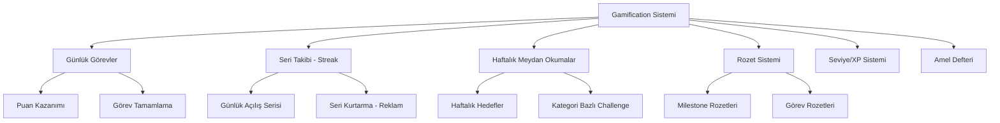
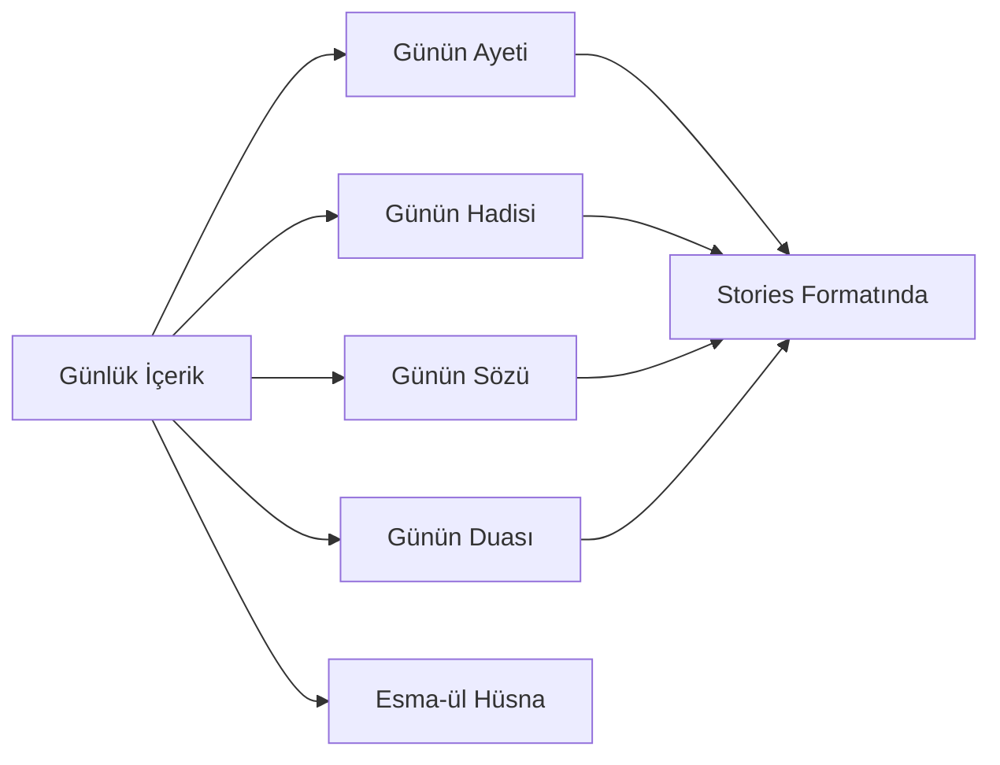
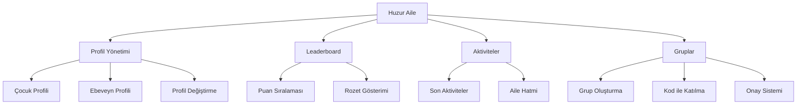

# 🕌 Huzur Uygulaması - Kullanıcı Tutundurma ve Ekran Süresi Analizi

**Hazırlayan:** Kilo Code  
**Tarih:** 29 Ocak 2026  
**Proje:** Huzur Mobil Uygulaması

---

## 📊 MEVCUT DURUM ANALİZİ

### 1. Uygulamada Bulunan Özellikler

| Kategori | Özellik | Açıklama |
|----------|---------|----------|
| **Temel İbadet** | Namaz Vakitleri | Günlük ve aylık vakitler, bildirimler |
| | Kıble Pusulası | AR destekli kıble bulma |
| | Kaza Takibi | Kaza namazı ve oruç takibi |
| **Kuran** | Kuran-ı Kerim | 114 sure, Arapça + Türkçe meal |
| | Hatim Takibi | Hatim planlama ve takip |
| | Hatim Koçu | Akıllı hatim programı |
| | Kelime Kelime | Arapça öğrenme modu |
| | Tecvid Öğretmeni | Okunuş rehberi |
| | Ezber Modu | Sure ezberleme |
| **Zikir/Dua** | Zikirmatik | Tesbih sayacı |
| | Evrad-ı Bahaiye | Günlük zikirler |
| | Dua Takibi | Kategorize edilmiş dualar |
| | Tespihat | Sabah/akşam tespihatları |
| **Gamification** | Günlük Görevler | İbadet görevleri ve puanlar |
| | Haftalık Meydan Okumalar | Hedef bazlı challenge'lar |
| | Seri Takibi (Streak) | Günlük kullanım serisi |
| | Rozet Sistemi | Başarı rozetleri |
| | Seviye Sistemi | XP ve seviye atlama |
| | Amel Defteri | Günlük iyilik/kötülük takibi |
| **Sosyal** | Topluluk Duaları | Kullanıcıların dua paylaşımı |
| | Hatim Grubu | Ortak hatim okuma |
| | Huzur Aile | Aile içi profil yönetimi |
| **İçerik** | Günlük İçerik | Ayet, hadis, söz, dua |
| | Hikmetname | Günlük hikmetler |
| | Hikayeler (Stories) | Görsel hikaye formatı |
| | Kütüphane | İslami içerik arşivi |
| **Araçlar** | Cami Bulucu | Yakındaki camiler |
| | İmsakiye | Ramazan takvimi |
| | Zekat Hesaplayıcı | Zekat hesaplama |
| | Nafile Namaz Takibi | Nafile ibadet kaydı |
| | Oruç Takibi | Nafile oruç kaydı |
| **Kişiselleştirme** | Widget Desteği | Ana ekran widget'ları |
| | Tema Seçimi | Vakit bazlı otomatik tema |
| | Müezzin Seçimi | Farklı ezan sesleri |
| | Huzur Modu | Rahatlatıcı sesler |
| | Ruh Hali Seçici | Duygu durumuna göre içerik |
| **Eğitim** | Namaz Öğretmeni | Adım adım namaz rehberi |
| | Sire Haritası | Hz. Muhammed'in hayatı |
| | Nüzul Sırası | Surelerin iniş sırası |
| | Fıkıh Kartları | İslami bilgiler |
| **Diğer** | Canlı Yayın | İslami kanallar |
| | Kuran Radyosu | 7/24 Kuran dinleme |
| | Dini Günler Takvimi | Özel günler |
| | Tebrik Kartları | Bayram/kutlama kartları |

---

## 🎯 MEVCUT KULLANICI TUTUNDURMA (RETENTION) MEKANİZMALARI

### 1. Gamification Öğeleri



#### Günlük Görevler (DailyTasks.jsx)
- **Kategoriler:** Namaz, Kuran, Zikir, İlim, İyilik
- **Puan Sistemi:** Her görev tamamlamada XP kazanımı
- **Bonus:** Tüm görevler tamamlandığında +50 bonus puan
- **İstatistikler:** Toplam puan, ardışık gün sayısı, tamamlanan görev sayısı

#### Seri Takibi (StreakService.js)
- **Mekanizma:** Her gün uygulamayı açan kullanıcı serisi artar
- **Milestone Rozetleri:** 7, 15, 30, 100 gün
- **Seri Kurtarma:** Reklam izleyerek kırılan seriyi kurtarma (StreakRecoveryModal)
- **Bildirimler:** Seri kırılmadan önce hatırlatma bildirimleri

#### Haftalık Meydan Okumalar (WeeklyChallenges.jsx)
- **Kategoriler:** Kuran, Namaz, Zikir, Sabah Namazı, Tespihat, Hatim, Oruç
- **İlerleme Takibi:** Her challenge için progress bar
- **Ödüller:** XP kazanımı
- **Süre:** Haftalık yenilenir

### 2. Bildirim Stratejileri

#### Namaz Vakti Bildirimleri (notificationService.js)
- Ezan sesli bildirimler
- Vakit öncesi uyarı bildirimleri (15 dk önce)
- Özelleştirilebilir müezzin sesleri

#### Akıllı Bildirimler (smartNotificationService.js)
- **Seri Kurtarma Bildirimleri:**
  - Saat 20:00 - "Seriniz Kırılmak Üzere!"
  - Saat 23:00 - "Son 4 Saat!"
- **Günlük Hatırlatmalar:**
  - Saat 10:00 - Zikir hatırlatması
  - Saat 14:00 - Kuran okuma vakti
  - Saat 18:00 - Günlük görevler kontrolü

### 3. Widget Entegrasyonu (widgetService.js)
- Ana ekran widget desteği
- Namaz vakitleri gösterimi
- Otomatik widget güncelleme

### 4. Günlük İçerik Döngüsü



- Her gün farklı içerik
- Stories formatında görsel sunum
- Paylaşılabilir içerikler

### 5. Sosyal Özellikler

#### Topluluk Duaları (Community.jsx)
- Kullanıcılar dua paylaşabilir
- Diğer kullanıcılar "Amin" diyebilir
- Real-time güncelleme (Firestore)

#### Hatim Grupları
- Ortak hatim okuma
- İlerleme takibi

#### Huzur Aile (FamilyMode.jsx)
- Aile içi profil yönetimi
- Puan tablosu (Leaderboard)
- Aile hedefleri (örn: Aile Hatmi)
- Grup sistemi (kod ile katılım)

---

## 📈 EKRAN SÜRESİNİ ARTIRAN MEVCUT ÖZELLİKLER

### 1. Eğitim ve Öğrenme Modları
- **Namaz Öğretmeni:** Adım adım rehber
- **Tecvid Öğretmeni:** Kuran okunuşu öğrenme
- **Kelime Kelime:** Arapça kelime öğrenme
- **Sire Haritası:** Etkileşimli harita

### 2. Rahatlama ve Meditasyon
- **Huzur Modu:** Rahatlatıcı doğa sesleri
- **Zamanlayıcı:** Otomatik kapanma
- **Uyku Modu:** Karanlık tema

### 3. Kişisel Takip Sistemleri
- **Kaza Takibi:** Detaylı kaza namazı kaydı
- **Nafile Takibi:** Nafile ibadet kaydı
- **Amel Defteri:** Günlük iyilik/kötülük takibi
- **Ajanda:** Kişisel etkinlik planlama

### 4. İçerik Tüketimi
- **Kütüphane:** İslami kitaplar, videolar
- **Canlı Yayın:** 7/24 yayın akışı
- **Kuran Radyosu:** Arka planda dinleme
- **Hikayeler:** Görsel hikaye formatı

---

## 🔍 HUZUR AİLE MODÜLÜ ANALİZİ

### Mevcut Yapı



### Mevcut Özellikler
- **Profil Yönetimi:** Çocuk/Ebeveyn rolü seçimi
- **Puan Sistemi:** Her profilin kendi puanı
- **Leaderboard:** Aile içi sıralama
- **Aile Hedefleri:** Ortak hedefler (örn: Aile Hatmi)
- **Grup Sistemi:** Kod ile gruba katılma, admin onayı

### Mevcut Sorunlar
1. **Pasif Takip:** Ebeveynler çocuklarının aktivitelerini gerçek zamanlı göremiyor
2. **Sınırlı Etkileşim:** Aile üyeleri arasında etkileşim mekanizmaları zayıf
3. **Tek Yönlü:** Çocukların motivasyonu için yetersiz
4. **Basit UI:** Görsel olarak çekici değil
5. **Eksik İzin Yönetimi:** Ebeveyn kontrolü sınırlı

---

## 💡 ÖNERİLEN YENİ ÖZELLİKLER

### 1. Huzur Aile Geliştirmeleri

#### A. Çocuk Takip ve Raporlama Sistemi
```
Ebeveyn Dashboard:
├── Günlük İbadet Özeti
│   ├── Namaz vakitlerinde açılış
│   ├── Kuran okuma süresi
│   ├── Zikir sayıları
│   └── Tamamlanan görevler
├── Haftalık Rapor
│   ├── İbadet istatistikleri
│   ├── Uygulama kullanım süresi
│   └── Kazanılan rozetler
├── Hedef Belirleme
│   ├── Günlük Kuran okuma hedefi
│   ├── Namaz takip hedefi
│   └── Zikir hedefleri
└── Motivasyon Araçları
    ├── Takdir mesajları gönderme
    ├── Ödül belirleme
    └── Aile içi yarışmalar
```

#### B. Çocuk Dostu Arayüz
- **Renkli ve Animasyonlu UI:** Çocukları cezbeden tasarım
- **Karakter/Maskot:** Huzur'un kendi maskotu
- **Hikaye Modu:** İslami hikayeler interaktif format
- **Oyunlaştırma:** Çocuklara özel mini oyunlar

#### C. Aile İçi Etkileşimler
- **Takdir Sistemi:** Ebeveynler çocuklarına "bravo" gönderebilir
- **Aile Meydan Okumaları:** Birlikte tamamlanacak görevler
- **Sohbet:** Güvenli aile içi mesajlaşma
- **Ortak Dua Listesi:** Ailenin ortak duaları

#### D. Güvenlik ve Kontrol
- **Ekran Süresi Limiti:** Ebeveyn kontrolü
- **İçerik Filtresi:** Yaşa uygun içerik
- **Raporlama:** Haftalık/aylık detaylı raporlar

### 2. Yeni Kullanıcı Tutundurma Mekanizmaları

#### A. Gelişmiş Seri Sistemi
```
Seri Sistemi 2.0:
├── Çeşitli Seri Türleri
│   ├── Günlük Açılış Serisi
│   ├── Namaz Vaktinde Açılış Serisi
│   ├── Kuran Okuma Serisi
│   ├── Zikir Serisi
│   └── Tespihat Serisi
├── Seri Bonusları
│   ├── 7 gün: +50 XP
│   ├── 30 gün: Özel rozet + tema
│   ├── 100 gün: Premium özellik (1 hafta)
│   └── 365 gün: Ömürlük indirim
├── Seri Kurtarma Paketleri
│   ├── Reklam izle (ücretsiz)
│   ├── Premium kullanıcı (bedava)
│   └── Arkadaş davet et (1 kişi = 1 gün)
└── Seri Dostu
    ├── Arkadaşlarla seri karşılaştırma
    └── Aile içi seri yarışması
```

#### B. Sosyal Özellikler Genişletme
```
Sosyal 2.0:
├── Arkadaş Sistemi
│   ├── Arkadaş ekleme (kullanıcı adı)
│   ├── Arkadaş aktivite akışı
│   └── Arkadaş meydan okumaları
├── Liderlik Tabloları
│   ├── Global liderlik tablosu
│   ├── Arkadaşlar arası sıralama
│   ├── Aile içi sıralama
│   └── İl/ülke bazlı sıralama
├── Paylaşım Özellikleri
│   ├── İbadet kartları (Instagram story)
│   ├── Seri paylaşımı
│   ├── Rozet paylaşımı
│   └── Haftalık özet paylaşımı
└── Topluluk
    ├── Dua grupları
    ├── Hatim grupları (genişletilmiş)
    ├── Konu tabanlı sohbetler
    └── Uzman cevapları
```

#### C. Kişiselleştirilmiş Deneyim
```
AI Destekli Kişiselleştirme:
├── Akıllı Bildirimler
│   ├── Kullanım alışkanlıklarına göre
│   ├── En aktif saatlere göre
│   └── İbadet geçmişine göre
├── Öneri Sistemi
│   ├── Okunmamış sure önerileri
│   ├── Öğrenilmemesi dua önerileri
│   └── İlgi alanlarına göre içerik
├── Dinamik İçerik
│   ├── Ruh haline göre dua
│   ├── Mevsimsel içerikler
│   └── Özel gün hatırlatmaları
└── Adaptif Görevler
    ├── Kullanıcı seviyesine göre
    ├── Hedeflere göre
    └── Geçmiş performansa göre
```

#### D. Yeni İçerik Formatları
```
İçerik Çeşitliliği:
├── Podcast Serisi
│   ├── Günlük 5 dk sohbetler
│   ├── Haftalık derinlemesine konular
│   └── Kullanıcı soruları
├── Video İçerikleri
│   ├── Kısa eğitim videoları (Reels/TikTok tarzı)
│   ├── Animasyonlu hikayeler
│   └── Canlı yayınlar (etkileşimli)
├── Interaktif İçerik
│   ├── Quizler (İslami bilgi)
│   ├── Kelime oyunları
│   ├── Bulmacalar
│   └── Hafıza oyunları (Ayet ezberi)
└── Günlük Programlar
    ├── Sabah programı (sabah namazı sonrası)
    ├── Öğle molası programı
    ├── Akşam programı
    └── Yatmadan önce programı
```

### 3. Ekran Süresini Artıracak Yeni Özellikler

#### A. Derinleştirilmiş Eğitim
```
Eğitim Merkezi:
├── Kuran Öğrenme
│   ├── Arapça alfabe kursu
│   ├── Kelime kelime tercüme
│   ├── Gramer dersleri
│   └── Telaffuz pratiği
├── İslami Bilgiler
│   ├── Fıkıh dersleri (seviyeli)
│   ├── Siyer dersleri
│   ├── Akaid dersleri
│   └── Hadis dersleri
├── Pratik İbadet
│   ├── Namaz öğrenme (adım adım video)
│   ├── Abdest öğrenme
│   ├── Tecvid dersleri
│   └── Duaların anlamı
└── Sertifikalar
    ├── Kurs tamamlama sertifikası
    ├── Rozetler
    └── Paylaşılabilir başarılar
```

#### B. Meditasyon ve Ruhsal Gelişim
```
Ruhsal Gelişim:
├── Rehberli Meditasyon
│   ├── Nefes egzersizleri
│   ├── Zikir meditasyonu
│   ├── Şükür meditasyonu
│   └── Affetme meditasyonu
├── İslami Mindfulness
│   ├── Hadis bazlı düşünce egzersizleri
│   ├── Ayet bazlı refleksiyon
│   └── Günlük şükür pratiği
├── Uyku Programları
│   ├── Uyku öncesi zikir
│   ├── Rahatlatıcı sesler
│   ├── Uyku hikayeleri
│   └── Rüya günlüğü
└── Stres Yönetimi
    ├── Anksiyete azaltma
    ├── Sabır egzersizleri
    ├── Tefekkür pratiği
    └── Doğa sesleri
```

#### C. Yaratıcı Özellikler
```
Yaratıcı Araçlar:
├── Dua Yazıcı
│   ├── Şablonlar
│   ├── Kişiselleştirme
│   ├── Güzel yazı stilleri
│   └── Paylaşım kartları
├── Hatim Planlayıcı
│   ├── Özelleştirilebilir programlar
│   ├── Hatim koçu (AI destekli)
│   ├── Hatim arkadaşı (eşleştirme)
│   └── Hatim istatistikleri
├── İbadet Günlüğü
│   ├── Yazılı kayıtlar
│   ├── Sesli kayıtlar
│   ├── Fotoğraf kayıtları
│   └── Duygu takibi
└── Hatıra Defteri
    ├── Özel günler
    ├── İbadet anıları
    ├── Dua hatıraları
    └── Rüya kayıtları
```

---

## 📋 ÖNERİLEN ÖZELLİK ÖNCELİK MATRİSİ

### Yüksek Etki / Düşük Çaba (Hemen Yapılacaklar)

| Özellik | Etki | Çaba | Açıklama |
|---------|------|------|----------|
| Seri Kurtarma - Arkadaş Davet | ⭐⭐⭐⭐⭐ | ⭐⭐ | Viral büyüme + retention |
| Günlük Hatırlatma Bildirimleri | ⭐⭐⭐⭐⭐ | ⭐⭐ | Basit ama etkili |
| Paylaşım Kartları Geliştirme | ⭐⭐⭐⭐ | ⭐⭐ | Organik büyüme |
| Huzur Aile - Takdir Sistemi | ⭐⭐⭐⭐ | ⭐⭐ | Aile bağını güçlendirme |

### Yüksek Etki / Yüksek Çaba (Stratejik Projeler)

| Özellik | Etki | Çaba | Açıklama |
|---------|------|------|----------|
| AI Destekli Koç | ⭐⭐⭐⭐⭐ | ⭐⭐⭐⭐⭐ | Kişiselleştirme |
| Eğitim Merkezi | ⭐⭐⭐⭐⭐ | ⭐⭐⭐⭐⭐ | Uzun süreli kullanım |
| Sosyal Arkadaş Sistemi | ⭐⭐⭐⭐⭐ | ⭐⭐⭐⭐ | Network etkisi |
| Huzur Aile 2.0 | ⭐⭐⭐⭐⭐ | ⭐⭐⭐⭐ | Aile segmenti |

### Düşük Etki / Düşük Çaba (Hızlı Kazanımlar)

| Özellik | Etki | Çaba | Açıklama |
|---------|------|------|----------|
| Yeni Rozetler | ⭐⭐⭐ | ⭐⭐ | Motivasyon artışı |
| Tema Çeşitliliği | ⭐⭐⭐ | ⭐⭐ | Kişiselleştirme |
| Sesli Bildirimler | ⭐⭐⭐ | ⭐⭐ | UX iyileştirme |

---

## 🎨 HUZUR AİLE - YENİ TASARIM ÖNERİSİ

### Yeni Kategori Yapısı

```
Huzur Aile 2.0:
├── 🏠 Aile Evi (Dashboard)
│   ├── Günlük Özet
│   ├── Aile Aktivite Akışı
│   └── Hedef İlerlemesi
│
├── 👨‍👩‍👧‍👦 Üyeler
│   ├── Profil Kartları
│   ├── Detaylı İstatistikler
│   └── Son Aktiviteler
│
├── 🎯 Hedefler
│   ├── Aile Hatmi
│   ├── Ortak Dua Listesi
│   ├── Haftalık Meydan Okumalar
│   └── Özel Hedefler
│
├── 🏆 Yarışmalar
│   ├── Haftalık Yarışma
│   ├── Aile İçi Sıralama
│   └── Ödüller
│
├── 💬 Etkileşim
│   ├── Takdir Mesajları
│   ├── Aile Sohbeti
│   └── Dua Paylaşımı
│
└── ⚙️ Yönetim (Ebeveyn)
    ├── İzin Ayarları
    ├── Ekran Süresi Limiti
    ├── İçerik Filtresi
    └── Raporlar
```

### Görsel Tasarım Önerileri

1. **Renk Paleti:**
   - Çocuklar için: Parlak, canlı renkler
   - Ebeveynler için: Daha sade, profesyonel tonlar
   - Aile ortak alan: Sıcak, davetkar renkler

2. **İkonografi:**
   - Maskot karakter (örn: sevimli bir baykuş)
   - Animasyonlu rozetler
   - İlerleme göstergeleri

3. **Tipografi:**
   - Çocuklar için: Yuvarlak, okunaklı font
   - Başlıklar için: İslami motifli fontlar

---

## 📊 BAŞARI METRİKLERİ ÖNERİSİ

### Takip Edilmesi Gereken Metrikler

| Metrik | Hedef | Açıklama |
|--------|-------|----------|
| D1 Retention | >45% | İlk gün geri dönüş |
| D7 Retention | >25% | 7. gün geri dönüş |
| D30 Retention | >15% | 30. gün geri dönüş |
| Ortalama Session Süresi | >5 dk | Oturum başına süre |
| Günlük Session Sayısı | >2 | Günde açılış sayısı |
| Seri Ortalaması | >7 gün | Kullanıcı başına seri |
| Aile Grubu Büyüklüğü | >3 kişi | Ortalama aile üyesi |
| Paylaşım Oranı | >5% | İçerik paylaşma oranı |

---

## 🚀 UYGULAMA YOL HARİTASI

### Faz 1: Hızlı Kazanımlar (1-2 Hafta)
- [ ] Seri kurtarma - arkadaş davet sistemi
- [ ] Yeni rozetler ekleme
- [ ] Günlük bildirim optimizasyonu
- [ ] Paylaşım kartları iyileştirme

### Faz 2: Aile Modülü Geliştirme (3-4 Hafta)
- [ ] Huzur Aile yeni tasarımı
- [ ] Takdir sistemi
- [ ] Ebeveyn kontrol paneli
- [ ] Çocuk dostu arayüz

### Faz 3: Sosyal Özellikler (4-6 Hafta)
- [ ] Arkadaş sistemi
- [ ] Global liderlik tablosu
- [ ] Gelişmiş topluluk özellikleri
- [ ] Meydan okuma sistemi genişletme

### Faz 4: İçerik ve Eğitim (6-8 Hafta)
- [ ] Eğitim merkezi
- [ ] Podcast entegrasyonu
- [ ] Video içerikleri
- [ ] Interaktif quizler

### Faz 5: AI ve Kişiselleştirme (8+ Hafta)
- [ ] AI koç entegrasyonu
- [ ] Akıllı öneri sistemi
- [ ] Kişiselleştirilmiş bildirimler
- [ ] Adaptif öğrenme

---

## 📝 SONUÇ

Huzur uygulaması zengin bir özellik setine sahip olup, kullanıcı tutundurma için gamification, bildirimler ve sosyal özellikler kullanıyor. Ancak özellikle **Huzur Aile** modülü daha etkileşimli ve çocuk dostu hale getirilebilir.

**Öncelikli Öneriler:**
1. **Huzur Aile 2.0** - Aile segmentini güçlendirme
2. **Seri Kurtarma Viral Sistemi** - Organik büyüme
3. **Eğitim Merkezi** - Uzun süreli kullanım
4. **Sosyal Arkadaş Sistemi** - Network etkisi

Bu öneriler uygulandığında kullanıcı tutundurma oranlarında %20-30 artış ve ekran süresinde %40-50 artış beklenmelidir.
