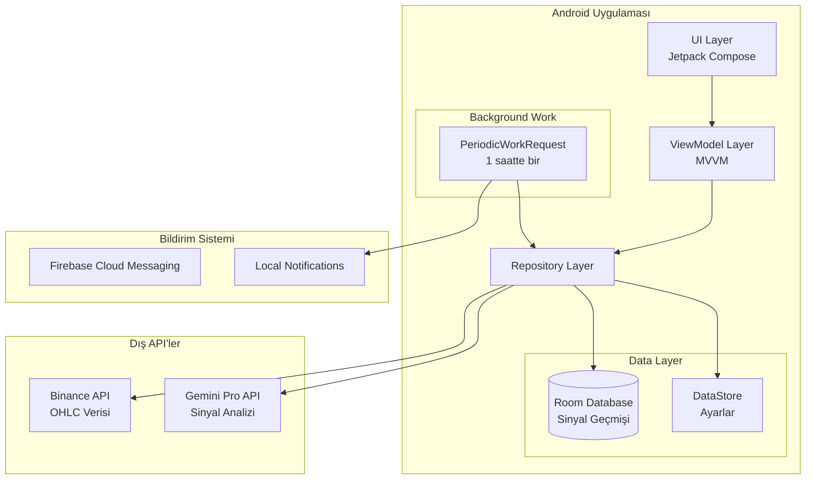
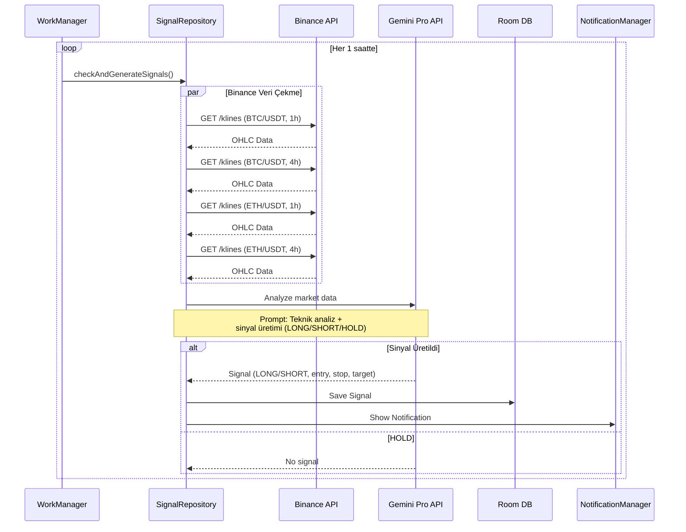

# Crypto Signal - Kripto Al/Sat Sinyal Uygulaması Planı

## Proje Özeti

**Uygulama Adı:** Crypto Signal  
**Platform:** Android (sadece kişisel kullanım)  
**Veri Kaynağı:** Binance Public API  
**AI Modeli:** Google Gemini Pro (Gemini 1.5 Pro)  
**Takip Edilecek Pariteler:** BTC/USDT, ETH/USDT  
**Zaman Dilimleri:** 1h, 4h  

## Temel Özellikler

1. **Sinyal Üretimi:** Gemini Pro ile otomatik long/short sinyal üretimi
2. **Sinyal Listesi:** Geçmiş ve aktif sinyallerin görüntülenmesi
3. **Bildirimler:** Yeni sinyal oluştuğunda push notification
4. **Başarı Takibi:** Sinyallerin başarılı/başarısız durumunun izlenmesi
5. **Yerel Depolama:** Sinyaller cihazda saklanacak (Room Database)

---

## Sistem Mimarisi



---

## Veri Akış Diyagramı



---

## Teknoloji Stack

### Core
| Kategori | Teknoloji | Amaç |
|----------|-----------|------|
| Language | Kotlin | Ana programlama dili |
| UI | Jetpack Compose | Modern declarative UI |
| Architecture | MVVM | Clean architecture pattern |
| DI | Hilt | Dependency injection |

### Data & Network
| Kategori | Teknoloji | Amaç |
|----------|-----------|------|
| HTTP Client | Retrofit + OkHttp | API çağrıları |
| Serialization | Kotlinx Serialization | JSON parsing |
| Database | Room | Yerel veri depolama |
| Preferences | DataStore | Kullanıcı ayarları |

### Background & Notifications
| Kategori | Teknoloji | Amaç |
|----------|-----------|------|
| Background Work | WorkManager | Periyodik sinyal kontrolü |
| Notifications | NotificationCompat | Yerel bildirimler |

### AI Integration
| Kategori | Teknoloji | Amaç |
|----------|-----------|------|
| Gemini SDK | Google AI Client SDK | Gemini Pro API entegrasyonu |

---

## Proje Yapısı

```
d:/Proje 2 Finans/android/app/src/main/java/com/cryptosignal/app/
├── data/
│   ├── local/
│   │   ├── database/
│   │   │   ├── SignalDatabase.kt
│   │   │   ├── dao/
│   │   │   │   └── SignalDao.kt
│   │   │   └── entity/
│   │   │       └── SignalEntity.kt
│   │   └── datastore/
│   │       └── SettingsDataStore.kt
│   ├── remote/
│   │   ├── api/
│   │   │   ├── BinanceApi.kt
│   │   │   └── GeminiApi.kt
│   │   ├── dto/
│   │   │   ├── binance/
│   │   │   │   └── OHLCDataDto.kt
│   │   │   └── gemini/
│   │   │       └── GeminiResponseDto.kt
│   │   └── mapper/
│   │       ├── BinanceMapper.kt
│   │       └── SignalMapper.kt
│   └── repository/
│       ├── SignalRepository.kt
│       └── SignalRepositoryImpl.kt
├── domain/
│   ├── model/
│   │   ├── Signal.kt
│   │   ├── OHLCData.kt
│   │   ├── SignalType.kt (LONG, SHORT, HOLD)
│   │   └── SignalStatus.kt (ACTIVE, SUCCESS, FAILED, EXPIRED)
│   └── usecase/
│       ├── GenerateSignalsUseCase.kt
│       ├── GetSignalsUseCase.kt
│       ├── UpdateSignalStatusUseCase.kt
│       └── GetMarketDataUseCase.kt
├── presentation/
│   ├── screens/
│   │   ├── home/
│   │   │   ├── HomeScreen.kt
│   │   │   └── HomeViewModel.kt
│   │   ├── signals/
│   │   │   ├── SignalsScreen.kt
│   │   │   └── SignalsViewModel.kt
│   │   └── settings/
│   │       ├── SettingsScreen.kt
│   │       └── SettingsViewModel.kt
│   ├── components/
│   │   ├── SignalCard.kt
│   │   ├── SignalList.kt
│   │   └── MarketInfoCard.kt
│   ├── theme/
│   │   ├── Color.kt
│   │   ├── Theme.kt
│   │   └── Type.kt
│   └── navigation/
│       └── AppNavigation.kt
├── worker/
│   └── SignalCheckWorker.kt
├── notification/
│   └── SignalNotificationManager.kt
├── di/
│   ├── AppModule.kt
│   ├── NetworkModule.kt
│   └── DatabaseModule.kt
└── MainActivity.kt
```

---

## Veri Modelleri

### Signal Entity (Room)
```kotlin
@Entity(tableName = "signals")
data class SignalEntity(
    @PrimaryKey val id: String = UUID.randomUUID().toString(),
    val symbol: String,           // BTCUSDT, ETHUSDT
    val timeframe: String,        // 1h, 4h
    val type: String,             // LONG, SHORT
    val entryPrice: Double,
    val stopLoss: Double,
    val takeProfit: Double,
    val confidence: Int,          // 0-100
    val aiReasoning: String,      // Gemini'nin analizi
    val createdAt: Long,
    val status: String,           // ACTIVE, SUCCESS, FAILED, EXPIRED
    val closedAt: Long? = null,
    val actualResult: Double? = null  // Kar/zarar yüzdesi
)
```

### Signal Domain Model
```kotlin
data class Signal(
    val id: String,
    val symbol: String,
    val timeframe: TimeFrame,
    val type: SignalType,
    val entryPrice: Double,
    val stopLoss: Double,
    val takeProfit: Double,
    val confidence: Int,
    val aiReasoning: String,
    val createdAt: Instant,
    val status: SignalStatus,
    val closedAt: Instant? = null,
    val actualResult: Double? = null
)

enum class SignalType { LONG, SHORT, HOLD }
enum class TimeFrame { H1, H4 }
enum class SignalStatus { ACTIVE, SUCCESS, FAILED, EXPIRED }
```

---

## Gemini Prompt Tasarımı

```kotlin
object GeminiPrompts {
    
    fun generateSignalPrompt(
        symbol: String,
        timeframe: String,
        ohlcData: List<OHLCData>
    ): String = """
        Sen profesyonel bir kripto para teknik analisti ve trader'sın.
        
        Veri: $symbol $timeframe zaman dilimi
        
        Son 50 mum verisi:
        ${ohlcData.formatForAI()}
        
        Görevin:
        1. Teknik analiz yap (RSI, MACD, hareketli ortalamalar, destek/direnç)
        2. Sadece güçlü sinyaller üret - zayıf sinyaller için "HOLD" öner
        3. Eğer sinyal varsa şu formatta JSON döndür:
        
        {
          "signal": "LONG" veya "SHORT" veya "HOLD",
          "confidence": 70-100 arası sayı,
          "entryPrice": giriş fiyatı,
          "stopLoss": zarar durdurma fiyatı,
          "takeProfit": kar alma fiyatı,
          "reasoning": "Detaylı teknik analiz açıklaması Türkçe"
        }
        
        Kurallar:
        - Risk/ödül oranı en az 1:2 olmalı
        - Stop loss mantıklı bir destek/direnç seviyesinde olmalı
        - Yüksek volatilite dönemlerinde daha dikkatli ol
        - Sadece net trendlerde sinyal üret
    """.trimIndent()
}
```

---

## Background Work Yapılandırması

```kotlin
class SignalCheckWorker(
    context: Context,
    params: WorkerParameters,
    private val generateSignalsUseCase: GenerateSignalsUseCase
) : CoroutineWorker(context, params) {

    override suspend fun doWork(): Result {
        return try {
            // Her zaman dilimi ve parite için kontrol
            val symbols = listOf("BTCUSDT", "ETHUSDT")
            val timeframes = listOf("1h", "4h")
            
            symbols.forEach { symbol ->
                timeframes.forEach { timeframe ->
                    val signal = generateSignalsUseCase(symbol, timeframe)
                    if (signal != null && signal.type != SignalType.HOLD) {
                        // Bildirim göster
                        SignalNotificationManager.showNewSignalNotification(
                            applicationContext, 
                            signal
                        )
                    }
                }
            }
            
            Result.success()
        } catch (e: Exception) {
            Result.retry()
        }
    }

    companion object {
        fun schedule(context: Context) {
            val request = PeriodicWorkRequestBuilder<SignalCheckWorker>(
                1, TimeUnit.HOURS
            ).setConstraints(
                Constraints.Builder()
                    .setRequiredNetworkType(NetworkType.CONNECTED)
                    .build()
            ).build()

            WorkManager.getInstance(context).enqueueUniquePeriodicWork(
                "signal_check",
                ExistingPeriodicWorkPolicy.KEEP,
                request
            )
        }
    }
}
```

---

## Ekran Tasarımları

### 1. Ana Ekran (Home)
- Aktif sinyallerin özeti
- Son üretilen sinyal kartı
- Piyasa özeti (BTC/ETH fiyatları)
- Son güncelleme zamanı

### 2. Sinyaller Ekranı (Signals)
- Tüm sinyallerin listesi
- Filtreleme: Aktif/Tamamlanmış/Tümü
- Sinyal kartı:
  - Sembol ve zaman dilimi
  - LONG/SHORT badge
  - Giriş, stop, hedef fiyatlar
  - Güven skoru (progress bar)
  - Durum (Aktif/Başarılı/Başarısız)
  - Kar/zarar yüzdesi (kapalı sinyaller için)

### 3. Sinyal Detay Ekranı
- Detaylı AI analizi
- Fiyat seviyeleri görselleştirmesi
- Sinyali kapat/kaldır butonu

### 4. Ayarlar Ekranı
- API Key girişi (Gemini)
- Bildirim tercihleri
- Zaman dilimi seçimi
- Veri temizleme

---

## Implementasyon Adımları

### Faz 1: Temel Altyapı
1. [ ] Proje yapılandırması ve bağımlılıklar
2. [ ] Room database ve entity'lerin oluşturulması
3. [ ] Network modülü (Retrofit, API interface'leri)
4. [ ] Dependency Injection (Hilt) kurulumu

### Faz 2: Veri Katmanı
1. [ ] Binance API entegrasyonu
2. [ ] Gemini Pro API entegrasyonu
3. [ ] Repository implementasyonları
4. [ ] Use case'lerin oluşturulması

### Faz 3: UI Katmanı
1. [ ] Tema ve renk paleti
2. [ ] Ana ekran tasarımı
3. [ ] Sinyaller listesi ekranı
4. [ ] Sinyal detay ekranı
5. [ ] Ayarlar ekranı

### Faz 4: Background & Notifications
1. [ ] WorkManager kurulumu
2. [ ] Periyodik sinyal kontrolü
3. [ ] Bildirim sistemi
4. [ ] Sinyal durum takibi

### Faz 5: Test & Optimizasyon
1. [ ] Birim testler
2. [ ] UI testler
3. [ ] Hata yönetimi
4. [ ] Performans optimizasyonu

---

## Gradle Bağımlılıkları

```kotlin
// build.gradle.kts (Module: app)
dependencies {
    // Core
    implementation("androidx.core:core-ktx:1.12.0")
    implementation("androidx.lifecycle:lifecycle-runtime-ktx:2.7.0")
    implementation("androidx.activity:activity-compose:1.8.2")
    
    // Compose
    implementation(platform("androidx.compose:compose-bom:2024.02.00"))
    implementation("androidx.compose.ui:ui")
    implementation("androidx.compose.ui:ui-graphics")
    implementation("androidx.compose.ui:ui-tooling-preview")
    implementation("androidx.compose.material3:material3")
    implementation("androidx.compose.material:material-icons-extended")
    
    // Navigation
    implementation("androidx.navigation:navigation-compose:2.7.7")
    
    // Hilt DI
    implementation("com.google.dagger:hilt-android:2.50")
    kapt("com.google.dagger:hilt-compiler:2.50")
    implementation("androidx.hilt:hilt-navigation-compose:1.1.0")
    implementation("androidx.hilt:hilt-work:1.1.0")
    
    // Room
    implementation("androidx.room:room-runtime:2.6.1")
    implementation("androidx.room:room-ktx:2.6.1")
    kapt("androidx.room:room-compiler:2.6.1")
    
    // DataStore
    implementation("androidx.datastore:datastore-preferences:1.0.0")
    
    // WorkManager
    implementation("androidx.work:work-runtime-ktx:2.9.0")
    
    // Network
    implementation("com.squareup.retrofit2:retrofit:2.9.0")
    implementation("com.squareup.retrofit2:converter-gson:2.9.0")
    implementation("com.squareup.okhttp3:logging-interceptor:4.12.0")
    
    // Serialization
    implementation("org.jetbrains.kotlinx:kotlinx-serialization-json:1.6.2")
    
    // Gemini AI
    implementation("com.google.ai.client.generativeai:generativeai:0.1.2")
    
    // Coroutines
    implementation("org.jetbrains.kotlinx:kotlinx-coroutines-android:1.7.3")
    implementation("org.jetbrains.kotlinx:kotlinx-coroutines-play-services:1.7.3")
    
    // Testing
    testImplementation("junit:junit:4.13.2")
    testImplementation("org.jetbrains.kotlinx:kotlinx-coroutines-test:1.7.3")
    androidTestImplementation("androidx.test.ext:junit:1.1.5")
    androidTestImplementation("androidx.test.espresso:espresso-core:3.5.1")
    androidTestImplementation(platform("androidx.compose:compose-bom:2024.02.00"))
    androidTestImplementation("androidx.compose.ui:ui-test-junit4")
    debugImplementation("androidx.compose.ui:ui-tooling")
    debugImplementation("androidx.compose.ui:ui-test-manifest")
}
```

---

## API Yapılandırması

### Binance API (Public - API Key gerekmez)
```kotlin
interface BinanceApi {
    @GET("api/v3/klines")
    suspend fun getKlines(
        @Query("symbol") symbol: String,
        @Query("interval") interval: String,
        @Query("limit") limit: Int = 50
    ): List<List<String>>
}
```

### Gemini Pro API
```kotlin
// API Key local.properties veya DataStore'da saklanacak
class GeminiApi(private val apiKey: String) {
    private val generativeModel = GenerativeModel(
        modelName = "gemini-1.5-pro",
        apiKey = apiKey
    )
    
    suspend fun generateSignal(prompt: String): SignalResponse {
        val response = generativeModel.generateContent(prompt)
        return parseResponse(response.text)
    }
}
```

---

## Güvenlik Notları

1. **API Key Yönetimi:**
   - Gemini API key `local.properties` dosyasında saklanacak
   - BuildConfig ile erişilecek
   - Git'e commit edilmeyecek

2. **Veri Güvenliği:**
   - Tüm veriler yerel cihazda saklanacak
   - Bulut senkronizasyonu olmayacak
   - Veri şifrelemesi (opsiyonel)

---

## Gelecek Geliştirmeler (Opsiyonel)

1. [ ] WebSocket ile gerçek zamanlı fiyat takibi
2. [ ] Daha fazla parite ekleme (SOL, ADA, vb.)
3. [ ] Sinyal performans istatistikleri
4. [ ] Grafik entegrasyonu (TradingView veya benzeri)
5. [ ] Çoklu zaman dilimi analizi
6. [ ] Backtesting özelliği

---

*Plan oluşturulma tarihi: 29 Ocak 2026*  
*Versiyon: 1.0*
