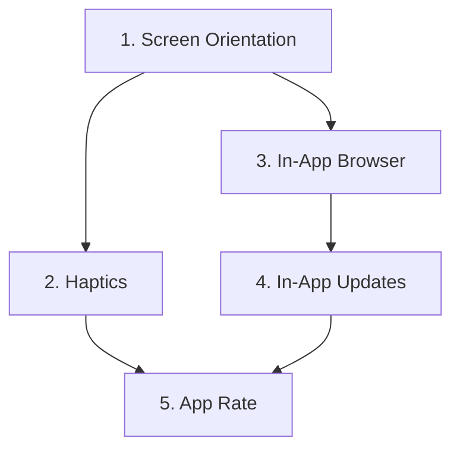

# Huzur App - Mobil Özellikler Entegrasyon Planı

## 📋 Proje Özeti

Bu doküman, Huzur App'e eklenecek 5 temel mobil özelliğin entegrasyon planını içermektedir:

1. **Haptics** - Kaliteli titreşim hissi
2. **App Rate** - Google Play puanlama stratejisi
3. **In-App Updates** - Uygulama içi güncelleme kontrolü
4. **In-App Browser** - Dış linkleri uygulama içinde açma
5. **Screen Orientation** - Dikey mod kilidi

---

## 🔍 Mevcut Durum Analizi

### Teknoloji Stack
- **Framework**: React 19 + Vite 7
- **Mobile Runtime**: Capacitor 8
- **Platform**: Android (Google Play)
- **Dil**: JavaScript/JSX (TypeScript mevcut)

### Mevcut Capacitor Eklentileri
```
@capacitor/app: ^8.0.0
@capacitor/device: ^8.0.0
@capacitor/filesystem: ^8.0.0
@capacitor/geolocation: ^8.0.0
@capacitor/local-notifications: ^8.0.0
@capacitor/preferences: ^8.0.0
@capacitor/push-notifications: ^8.0.0
@capacitor/share: ^8.0.0
```

### Mevcut Titreşim Kullanımı
Şu anda `navigator.vibrate()` API kullanılıyor:
- `Zikirmatik.jsx`: 30ms titreşim
- `Tespihat.jsx`: 10ms titreşim
- `Adhkar.jsx`: 30ms titreşim

---

## 1️⃣ Haptics (Titreşim) Entegrasyonu

### Amaç
Mevcut basit `navigator.vibrate()` yerine, cihazın gelişmiş haptic motorlarını kullanarak kaliteli titreşim deneyimi sunmak.

### Kullanılacak Eklenti
```bash
npm install @capacitor/haptics
```

### Entegrasyon Planı

#### Adım 1: Eklenti Kurulumu
```bash
npm install @capacitor/haptics
npx cap sync
```

#### Adım 2: Haptics Servisi Oluşturma
**Dosya**: `src/services/hapticsService.js`

```javascript
import { Haptics, ImpactStyle, NotificationType } from '@capacitor/haptics';

class HapticsService {
  async isSupported() {
    const result = await Haptics.isSupported();
    return result.value;
  }

  // Hafif dokunma (button press)
  async lightImpact() {
    try {
      await Haptics.impact({ style: ImpactStyle.Light });
    } catch (e) {
      // Fallback to legacy
      if (navigator.vibrate) navigator.vibrate(10);
    }
  }

  // Orta şiddet (zikir sayacı)
  async mediumImpact() {
    try {
      await Haptics.impact({ style: ImpactStyle.Medium });
    } catch (e) {
      if (navigator.vibrate) navigator.vibrate(30);
    }
  }

  // Güçlü titreşim (hedef tamamlandı)
  async heavyImpact() {
    try {
      await Haptics.impact({ style: ImpactStyle.Heavy });
    } catch (e) {
      if (navigator.vibrate) navigator.vibrate([100, 50, 100]);
    }
  }

  // Başarı bildirimi (zikir tamamlandı)
  async successNotification() {
    try {
      await Haptics.notification({ type: NotificationType.Success });
    } catch (e) {
      if (navigator.vibrate) navigator.vibrate([100, 50, 100, 50, 100]);
    }
  }

  // Hata bildirimi
  async errorNotification() {
    try {
      await Haptics.notification({ type: NotificationType.Error });
    } catch (e) {
      if (navigator.vibrate) navigator.vibrate([50, 50, 50]);
    }
  }

  // Seçim değişimi
  async selectionChanged() {
    try {
      await Haptics.selectionChanged();
    } catch (e) {
      // No fallback needed
    }
  }
}

export const hapticsService = new HapticsService();
```

#### Adım 3: Bileşen Güncellemeleri

**Zikirmatik.jsx** - Zikir sayacı için:
```javascript
// Mevcut:
if (vibrateEnabled && navigator.vibrate) {
    navigator.vibrate(30);
}

// Yeni:
import { hapticsService } from '../services/hapticsService';

if (vibrateEnabled) {
    await hapticsService.mediumImpact();
}

// Hedef tamamlandığında:
if (newCount >= targets[selectedDhikr.id]) {
    await hapticsService.successNotification();
}
```

**Tespihat.jsx** - Tespihat için:
```javascript
// Mevcut:
if (navigator.vibrate) {
    navigator.vibrate(10);
}

// Yeni:
await hapticsService.lightImpact();
```

#### Android Gereksinimleri
- `AndroidManifest.xml`'de zaten `VIBRATE` izni mevcut ✅
- Ek izin gerekmez

---

## 2️⃣ App Rate (Puanlama) Entegrasyonu

### Amaç
Kullanıcıları doğru zamanda ve doğru strateji ile Google Play'de uygulamayı puanlamaya teşvik etmek.

### Kullanılacak Eklenti
```bash
npm install capacitor-rate-app
```

Alternatif: `cordova-plugin-apprate` (Capacitor uyumlu)

### Entegrasyon Planı

#### Adım 1: Eklenti Kurulumu
```bash
npm install capacitor-rate-app
npx cap sync
```

#### Adım 2: Rate Service Oluşturma
**Dosya**: `src/services/rateService.js`

```javascript
import { RateApp } from 'capacitor-rate-app';
import { Preferences } from '@capacitor/preferences';

const RATE_CONFIG = {
  MIN_DAYS_BEFORE_PROMPT: 7,           // İlk 7 gün bekle
  MIN_LAUNCHES_BEFORE_PROMPT: 5,       // En az 5 açılış
  DAYS_BETWEEN_PROMPTS: 30,            // Tekrar sorma süresi
  MIN_EVENTS_BEFORE_PROMPT: 10,        // En az 10 etkileşim
};

class RateService {
  async shouldShowPrompt() {
    const { value } = await Preferences.get({ key: 'rate_app_data' });
    const data = value ? JSON.parse(value) : {
      firstLaunchDate: Date.now(),
      launchCount: 0,
      eventCount: 0,
      lastPromptDate: null,
      hasRated: false,
      hasDeclined: false
    };

    // Zaten puanladı veya reddetti
    if (data.hasRated || data.hasDeclined) return false;

    const now = Date.now();
    const daysSinceFirst = (now - data.firstLaunchDate) / (1000 * 60 * 60 * 24);
    const daysSinceLastPrompt = data.lastPromptDate 
      ? (now - data.lastPromptDate) / (1000 * 60 * 60 * 24)
      : Infinity;

    // Koşulları kontrol et
    return (
      daysSinceFirst >= RATE_CONFIG.MIN_DAYS_BEFORE_PROMPT &&
      data.launchCount >= RATE_CONFIG.MIN_LAUNCHES_BEFORE_PROMPT &&
      data.eventCount >= RATE_CONFIG.MIN_EVENTS_BEFORE_PROMPT &&
      daysSinceLastPrompt >= RATE_CONFIG.DAYS_BETWEEN_PROMPTS
    );
  }

  async trackLaunch() {
    const { value } = await Preferences.get({ key: 'rate_app_data' });
    const data = value ? JSON.parse(value) : {
      firstLaunchDate: Date.now(),
      launchCount: 0,
      eventCount: 0,
      lastPromptDate: null,
      hasRated: false,
      hasDeclined: false
    };
    
    data.launchCount++;
    await Preferences.set({ key: 'rate_app_data', value: JSON.stringify(data) });
  }

  async trackEvent() {
    const { value } = await Preferences.get({ key: 'rate_app_data' });
    const data = value ? JSON.parse(value) : {
      firstLaunchDate: Date.now(),
      launchCount: 0,
      eventCount: 0,
      lastPromptDate: null,
      hasRated: false,
      hasDeclined: false
    };
    
    data.eventCount++;
    await Preferences.set({ key: 'rate_app_data', value: JSON.stringify(data) });
  }

  async requestReview() {
    try {
      // Önce koşulları kontrol et
      const shouldShow = await this.shouldShowPrompt();
      if (!shouldShow) return false;

      // Rate App'i göster
      await RateApp.requestReview();
      
      // Veriyi güncelle
      const { value } = await Preferences.get({ key: 'rate_app_data' });
      const data = JSON.parse(value);
      data.lastPromptDate = Date.now();
      await Preferences.set({ key: 'rate_app_data', value: JSON.stringify(data) });
      
      return true;
    } catch (error) {
      console.error('Rate app error:', error);
      return false;
    }
  }

  async markAsRated() {
    const { value } = await Preferences.get({ key: 'rate_app_data' });
    const data = value ? JSON.parse(value) : {};
    data.hasRated = true;
    await Preferences.set({ key: 'rate_app_data', value: JSON.stringify(data) });
  }

  async markAsDeclined() {
    const { value } = await Preferences.get({ key: 'rate_app_data' });
    const data = value ? JSON.parse(value) : {};
    data.hasDeclined = true;
    await Preferences.set({ key: 'rate_app_data', value: JSON.stringify(data) });
  }
}

export const rateService = new RateService();
```

#### Adım 3: Strateji ve Tetikleyiciler

**Optimal Zamanlar:**
1. Zikir tamamlandığında (hedefe ulaşıldığında)
2. 7 günlük streak başarıldığında
3. Hatim tamamlandığında
4. Ayarlar sayfasından manuel istek

**AppInitProvider.jsx** içinde:
```javascript
useEffect(() => {
  // Her açılışta takip et
  rateService.trackLaunch();
  
  // Belirli koşullarda göster
  const checkAndShow = async () => {
    const shouldShow = await rateService.shouldShowPrompt();
    if (shouldShow) {
      // Kullanıcı aktif olduktan sonra göster
      setTimeout(() => {
        rateService.requestReview();
      }, 5000);
    }
  };
  
  checkAndShow();
}, []);
```

---

## 3️⃣ In-App Updates Entegrasyonu

### Amaç
Kullanıcıları uygulama açılışında yeni güncellemeler hakkında bilgilendirmek ve esnek güncelleme sunmak.

### Kullanılacak Eklenti
```bash
npm install capacitor-inappupdate
```

### Entegrasyon Planı

#### Adım 1: Eklenti Kurulumu
```bash
npm install capacitor-inappupdate
npx cap sync
```

#### Adım 2: Update Service Oluşturma
**Dosya**: `src/services/updateService.js`

```javascript
import { InAppUpdate } from 'capacitor-inappupdate';
import { App } from '@capacitor/app';

class UpdateService {
  async checkForUpdate() {
    try {
      const result = await InAppUpdate.checkForUpdate();
      return result;
    } catch (error) {
      console.error('Update check error:', error);
      return { updateAvailable: false };
    }
  }

  async startFlexibleUpdate() {
    try {
      // Kullanıcı arka planda indirsin, sonra yüklensin
      await InAppUpdate.startFlexibleUpdate();
      
      // İndirme tamamlandığında
      const result = await InAppUpdate.addListener('onFlexibleUpdateState', (state) => {
        if (state === 'DOWNLOADED') {
          // Kullanıcıya yükleme bildirimi göster
          this.showInstallPrompt();
        }
      });
      
      return result;
    } catch (error) {
      console.error('Flexible update error:', error);
    }
  }

  async startImmediateUpdate() {
    try {
      // Zorunlu güncelleme - uygulama kullanılamaz
      await InAppUpdate.startImmediateUpdate();
    } catch (error) {
      console.error('Immediate update error:', error);
    }
  }

  async completeFlexibleUpdate() {
    try {
      await InAppUpdate.completeFlexibleUpdate();
    } catch (error) {
      console.error('Complete update error:', error);
    }
  }

  showInstallPrompt() {
    // Custom modal göster
    // "Yeni güncelleme indirildi. Şimdi yüklemek ister misiniz?"
  }
}

export const updateService = new UpdateService();
```

#### Adım 3: AppInitProvider Entegrasyonu
```javascript
useEffect(() => {
  const checkUpdate = async () => {
    const updateInfo = await updateService.checkForUpdate();
    
    if (updateInfo.updateAvailable) {
      if (updateInfo.priority >= 5) {
        // Yüksek öncelikli - zorunlu güncelleme
        await updateService.startImmediateUpdate();
      } else {
        // Düşük öncelikli - esnek güncelleme
        await updateService.startFlexibleUpdate();
      }
    }
  };
  
  checkUpdate();
}, []);
```

---

## 4️⃣ In-App Browser Entegrasyonu

### Amaç
Dış linkleri uygulama dışına çıkmadan, şık bir in-app browser penceresinde açmak.

### Kullanılacak Eklenti
```bash
npm install @capacitor/browser
```

### Entegrasyon Planı

#### Adım 1: Eklenti Kurulumu
```bash
npm install @capacitor/browser
npx cap sync
```

#### Adım 2: Browser Service Oluşturma
**Dosya**: `src/services/browserService.js`

```javascript
import { Browser } from '@capacitor/browser';

class BrowserService {
  async open(url, options = {}) {
    try {
      await Browser.open({
        url: url,
        presentationStyle: 'fullscreen', // fullscreen, popup
        toolbarColor: options.toolbarColor || '#4CAF50', // Huzur app rengi
        showArrow: true,
        showReloadButton: true
      });
    } catch (error) {
      console.error('Browser open error:', error);
      // Fallback: window.open
      window.open(url, '_blank');
    }
  }

  async close() {
    try {
      await Browser.close();
    } catch (error) {
      console.error('Browser close error:', error);
    }
  }

  addListener(event, callback) {
    return Browser.addListener(event, callback);
  }
}

export const browserService = new BrowserService();
```

#### Adım 3: Kullanım Alanları

**Ayarlar sayfası** (Support, Privacy Policy, Terms):
```javascript
import { browserService } from '../services/browserService';

const handleOpenLink = (url) => {
  browserService.open(url, {
    toolbarColor: '#4CAF50'
  });
};
```

**Dış kaynaklar** (Kuran tefsiri, hadis kaynakları):
```javascript
// Tefsir linki açma
const openTefsir = (surahNumber) => {
  const url = `https://example.com/tefsir/${surahNumber}`;
  browserService.open(url);
};
```

---

## 5️⃣ Screen Orientation Entegrasyonu

### Amaç
Uygulamayı dikey moda (portrait) kilitleyerek tutarlı bir kullanıcı deneyimi sunmak.

### Kullanılacak Eklenti
```bash
npm install @capacitor/screen-orientation
```

### Entegrasyon Planı

#### Adım 1: Eklenti Kurulumu
```bash
npm install @capacitor/screen-orientation
npx cap sync
```

#### Adım 2: Orientation Service Oluşturma
**Dosya**: `src/services/orientationService.js`

```javascript
import { ScreenOrientation } from '@capacitor/screen-orientation';

class OrientationService {
  async lockPortrait() {
    try {
      await ScreenOrientation.lock({
        orientation: 'portrait'
      });
    } catch (error) {
      console.error('Orientation lock error:', error);
    }
  }

  async lockLandscape() {
    try {
      await ScreenOrientation.lock({
        orientation: 'landscape'
      });
    } catch (error) {
      console.error('Orientation lock error:', error);
    }
  }

  async unlock() {
    try {
      await ScreenOrientation.unlock();
    } catch (error) {
      console.error('Orientation unlock error:', error);
    }
  }

  async getCurrentOrientation() {
    try {
      const result = await ScreenOrientation.getCurrentOrientation();
      return result;
    } catch (error) {
      console.error('Get orientation error:', error);
      return null;
    }
  }

  addListener(callback) {
    return ScreenOrientation.addListener('screenOrientationChange', callback);
  }
}

export const orientationService = new OrientationService();
```

#### Adım 3: AppInitProvider Entegrasyonu
```javascript
useEffect(() => {
  // Uygulama açıldığında dikey moda kilitle
  orientationService.lockPortrait();
}, []);
```

#### Android Gereksinimleri
`AndroidManifest.xml`'de Activity tanımına eklenecek:
```xml
<activity
    android:screenOrientation="portrait"
    ... >
```

Ancak Capacitor eklentisi kullanıldığında bu gerekli değildir.

---

## 📦 Kurulum Komutları Özeti

```bash
# 1. Tüm eklentileri tek seferde kur
npm install @capacitor/haptics capacitor-rate-app capacitor-inappupdate @capacitor/browser @capacitor/screen-orientation

# 2. Capacitor sync
npx cap sync

# 3. Android projesini güncelle
cd android && ./gradlew clean && cd ..
npx cap open android
```

---

## 🔄 Entegrasyon Sırası ve Bağımlılıklar



### Önerilen Sıra:

1. **Screen Orientation** (En kolay, bağımsız)
2. **Haptics** (Mevcut kodu değiştirir, test edilmesi kolay)
3. **In-App Browser** (Yeni özellik, mevcut linkleri değiştirir)
4. **In-App Updates** (Uygulama başlangıcını etkiler)
5. **App Rate** (En son, kullanıcı davranışlarına bağlı)

---

## ✅ Test Planı

### Haptics Test
- [ ] Zikirmatik'te her tıklamada titreşim
- [ ] Hedef tamamlandığında success titreşimi
- [ ] Tespihat'ta hafif titreşim
- [ ] Eski cihazlarda fallback çalışıyor mu?

### App Rate Test
- [ ] 7 gün/5 açılış koşulu çalışıyor mu?
- [ ] Zikir tamamlandığında prompt gösteriliyor mu?
- [ ] Reddedildikten sonra tekrar sormuyor mu?

### In-App Updates Test
- [ ] Güncelleme varsa tespit ediliyor mu?
- [ ] Flexible update akışı çalışıyor mu?
- [ ] Immediate update zorunlu mu?

### In-App Browser Test
- [ ] Dış linkler uygulama içinde açılıyor mu?
- [ ] Toolbar rengi uygulama temasına uyuyor mu?
- [ ] Geri butonu çalışıyor mu?

### Screen Orientation Test
- [ ] Uygulama dikeyde kilitli mi?
- [ ] Cihaz yatay çevrildiğinde dönüyor mu?

---

## 🚀 Sonraki Adımlar

1. Bu planı onaylayın
2. Code moduna geçiş yapın
3. Her özelliği sırayla implemente edin
4. Her özellik sonrası test yapın
5. Tüm entegrasyonlar tamamlandığında genel test yapın
