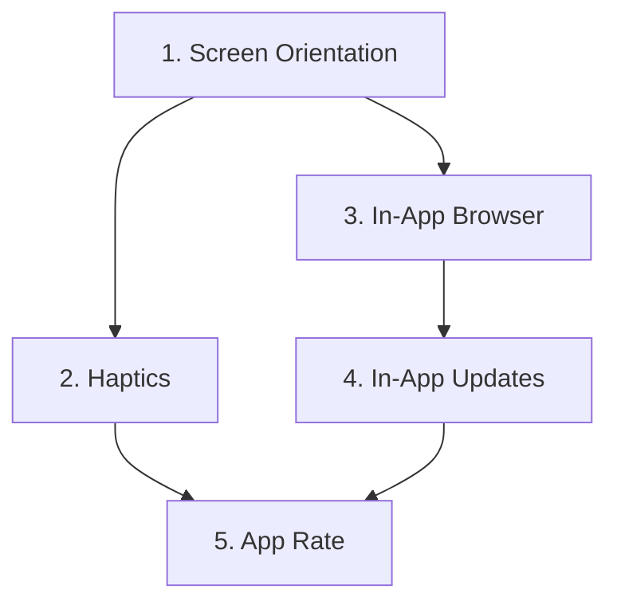

# Huzur App - Mobil Özellikler Entegrasyon Raporu

**Rapor Tarihi:** 01 Şubat 2026  
**Kaynak:** plans/mobile-features-integration-plan.md  
**Hazırlayan:** Architect Mode

---

## 📋 Executive Summary

Bu rapor, Huzur App'e entegre edilecek 5 temel mobil özelliğin detaylı analizini ve entegrasyon planını içermektedir. Plan, mevcut Capacitor 8 tabanlı mimariye uygun olarak hazırlanmıştır.

---

## 🎯 Entegre Edilecek Özellikler

| # | Özellik | Eklenti | Amaç |
|---|---------|---------|------|
| 1 | **Haptics** | @capacitor/haptics | Kaliteli titreşim hissi |
| 2 | **App Rate** | capacitor-rate-app | Google Play puanlama stratejisi |
| 3 | **In-App Updates** | capacitor-inappupdate | Uygulama içi güncelleme kontrolü |
| 4 | **In-App Browser** | @capacitor/browser | Dış linkleri uygulama içinde açma |
| 5 | **Screen Orientation** | @capacitor/screen-orientation | Dikey mod kilidi |

---

## 🔍 Mevcut Durum Analizi

### Teknoloji Stack
- **Framework:** React 19 + Vite 7
- **Mobile Runtime:** Capacitor 8
- **Platform:** Android (Google Play)
- **Dil:** JavaScript/JSX (TypeScript desteği mevcut)

### Mevcut Capacitor Eklentileri
```
@capacitor/app: ^8.0.0
@capacitor/device: ^8.0.0
@capacitor/filesystem: ^8.0.0
@capacitor/geolocation: ^8.0.0
@capacitor/local-notifications: ^8.0.0
@capacitor/preferences: ^8.0.0
@capacitor/push-notifications: ^8.0.0
@capacitor/share: ^8.0.0
```

### Mevcut Titreşim Kullanımı
Şu anda `navigator.vibrate()` API kullanılıyor:
- **Zikirmatik.jsx:** 30ms titreşim
- **Tespihat.jsx:** 10ms titreşim
- **Adhkar.jsx:** 30ms titreşim

---

## 1️⃣ Haptics (Titreşim) Entegrasyonu

### Amaç
Mevcut basit `navigator.vibrate()` yerine, cihazın gelişmiş haptic motorlarını kullanarak kaliteli titreşim deneyimi sunmak.

### Kullanılacak Eklenti
```bash
npm install @capacitor/haptics
```

### Servis Metodları

| Metod | Açıklama | Kullanım Alanı |
|-------|----------|----------------|
| `lightImpact()` | Hafif dokunma | Buton basışları |
| `mediumImpact()` | Orta şiddet | Zikir sayacı |
| `heavyImpact()` | Güçlü titreşim | Hedef tamamlandı |
| `successNotification()` | Başarı bildirimi | Zikir hedefi tamamlandı |
| `errorNotification()` | Hata bildirimi | Hata durumları |
| `selectionChanged()` | Seçim değişimi | Liste seçimleri |

### Fallback Stratejisi
Eski cihazlarda `navigator.vibrate()` kullanılacak:
```javascript
async mediumImpact() {
  try {
    await Haptics.impact({ style: ImpactStyle.Medium });
  } catch (e) {
    if (navigator.vibrate) navigator.vibrate(30);
  }
}
```

### Android Gereksinimleri
- `AndroidManifest.xml`'de zaten `VIBRATE` izni mevcut ✅
- Ek izin gerekmez

---

## 2️⃣ App Rate (Puanlama) Entegrasyonu

### Amaç
Kullanıcıları doğru zamanda ve doğru strateji ile Google Play'de uygulamayı puanlamaya teşvik etmek.

### Kullanılacak Eklenti
```bash
npm install capacitor-rate-app
```

### Puanlama Stratejisi

| Parametre | Değer | Açıklama |
|-----------|-------|----------|
| MIN_DAYS_BEFORE_PROMPT | 7 | İlk 7 gün bekle |
| MIN_LAUNCHES_BEFORE_PROMPT | 5 | En az 5 açılış |
| DAYS_BETWEEN_PROMPTS | 30 | Tekrar sorma süresi |
| MIN_EVENTS_BEFORE_PROMPT | 10 | En az 10 etkileşim |

### Tetikleyiciler (Optimal Zamanlar)
1. Zikir tamamlandığında (hedefe ulaşıldığında)
2. 7 günlük streak başarıldığında
3. Hatim tamamlandığında
4. Ayarlar sayfasından manuel istek

### Veri Yapısı
```javascript
{
  firstLaunchDate: Date.now(),
  launchCount: 0,
  eventCount: 0,
  lastPromptDate: null,
  hasRated: false,
  hasDeclined: false
}
```

---

## 3️⃣ In-App Updates Entegrasyonu

### Amaç
Kullanıcıları uygulama açılışında yeni güncellemeler hakkında bilgilendirmek ve esnek güncelleme sunmak.

### Kullanılacak Eklenti
```bash
npm install capacitor-inappupdate
```

### Güncelleme Türleri

| Tür | Açıklama | Kullanım Senaryosu |
|-----|----------|-------------------|
| **Flexible Update** | Arka planda indir, sonra yükle | Düşük öncelikli güncellemeler |
| **Immediate Update** | Zorunlu, uygulama kullanılamaz | Yüksek öncelikli güncellemeler |

### Öncelik Mantığı
```javascript
if (updateInfo.priority >= 5) {
  // Yüksek öncelikli - zorunlu güncelleme
  await updateService.startImmediateUpdate();
} else {
  // Düşük öncelikli - esnek güncelleme
  await updateService.startFlexibleUpdate();
}
```

---

## 4️⃣ In-App Browser Entegrasyonu

### Amaç
Dış linkleri uygulama dışına çıkmadan, şık bir in-app browser penceresinde açmak.

### Kullanılacak Eklenti
```bash
npm install @capacitor/browser
```

### Konfigürasyon
```javascript
await Browser.open({
  url: url,
  presentationStyle: 'fullscreen',
  toolbarColor: '#4CAF50', // Huzur app rengi
  showArrow: true,
  showReloadButton: true
});
```

### Kullanım Alanları
1. **Ayarlar sayfası:** Support, Privacy Policy, Terms
2. **Dış kaynaklar:** Kuran tefsiri, hadis kaynakları

---

## 5️⃣ Screen Orientation Entegrasyonu

### Amaç
Uygulamayı dikey moda (portrait) kilitleyerek tutarlı bir kullanıcı deneyimi sunmak.

### Kullanılacak Eklenti
```bash
npm install @capacitor/screen-orientation
```

### Servis Metodları

| Metod | Açıklama |
|-------|----------|
| `lockPortrait()` | Dikey moda kilitle |
| `lockLandscape()` | Yatay moda kilitle |
| `unlock()` | Kilidi kaldır |
| `getCurrentOrientation()` | Mevcut yönü al |

### Entegrasyon Noktası
`AppInitProvider.jsx` içinde uygulama açıldığında:
```javascript
useEffect(() => {
  orientationService.lockPortrait();
}, []);
```

---

## 📦 Kurulum Komutları Özeti

```bash
# 1. Tüm eklentileri tek seferde kur
npm install @capacitor/haptics capacitor-rate-app capacitor-inappupdate @capacitor/browser @capacitor/screen-orientation

# 2. Capacitor sync
npx cap sync

# 3. Android projesini güncelle
cd android && ./gradlew clean && cd ..
npx cap open android
```

---

## 🔄 Entegrasyon Sırası ve Bağımlılıklar



### Önerilen Sıra:

1. **Screen Orientation** (En kolay, bağımsız)
2. **Haptics** (Mevcut kodu değiştirir, test edilmesi kolay)
3. **In-App Browser** (Yeni özellik, mevcut linkleri değiştirir)
4. **In-App Updates** (Uygulama başlangıcını etkiler)
5. **App Rate** (En son, kullanıcı davranışlarına bağlı)

---

## ✅ Test Planı

### Haptics Test
- [ ] Zikirmatik'te her tıklamada titreşim
- [ ] Hedef tamamlandığında success titreşimi
- [ ] Tespihat'ta hafif titreşim
- [ ] Eski cihazlarda fallback çalışıyor mu?

### App Rate Test
- [ ] 7 gün/5 açılış koşulu çalışıyor mu?
- [ ] Zikir tamamlandığında prompt gösteriliyor mu?
- [ ] Reddedildikten sonra tekrar sormuyor mu?

### In-App Updates Test
- [ ] Güncelleme varsa tespit ediliyor mu?
- [ ] Flexible update akışı çalışıyor mu?
- [ ] Immediate update zorunlu mu?

### In-App Browser Test
- [ ] Dış linkler uygulama içinde açılıyor mu?
- [ ] Toolbar rengi uygulama temasına uyuyor mu?
- [ ] Geri butonu çalışıyor mu?

### Screen Orientation Test
- [ ] Uygulama dikeyde kilitli mi?
- [ ] Cihaz yatay çevrildiğinde dönüyor mu?

---

## 📁 Oluşturulacak Servis Dosyaları

| Servis | Dosya Yolu |
|--------|------------|
| HapticsService | src/services/hapticsService.js |
| RateService | src/services/rateService.js |
| UpdateService | src/services/updateService.js |
| BrowserService | src/services/browserService.js |
| OrientationService | src/services/orientationService.js |

---

## 🚀 Sonraki Adımlar

1. Bu raporu onaylayın
2. Code moduna geçiş yapın
3. Her özelliği sırayla implemente edin:
   - Screen Orientation
   - Haptics
   - In-App Browser
   - In-App Updates
   - App Rate
4. Her özellik sonrası test yapın
5. Tüm entegrasyonlar tamamlandığında genel test yapın

---

## 📊 Risk Değerlendirmesi

| Özellik | Risk Seviyesi | Neden |
|---------|---------------|-------|
| Haptics | Düşük | Fallback mekanizması var |
| App Rate | Düşük | Kullanıcı verisi local storage'da |
| In-App Updates | Orta | Google Play API bağımlılığı |
| In-App Browser | Düşük | Basit wrapper |
| Screen Orientation | Düşük | Native API kullanımı |

---

## 📝 Notlar

- Tüm eklentiler Capacitor 8 ile uyumlu
- AndroidManifest.xml'de VIBRATE izni zaten mevcut
- Eski cihazlar için fallback mekanizmaları planlandı
- Kullanıcı deneyimi öncelikli stratejiler belirlendi
