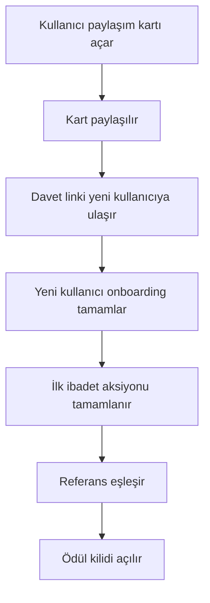

# Faz 3 Viral Büyüme Planı

## Hedef
- Ana hedef: organik edinimi artırmak
- North Star ile bağlantı: D30 elde tutmayı viral döngü ile güçlendirmek

## Kapsam
- Paylaşım kartları
- Davet linki
- Referans ödül akışı
- Event ölçüm şeması

## 1 Paylaşım Kartları Tasarımı

### Kart tipleri
- Günün ayeti kartı
- Günün duası kartı
- Streak başarı kartı

### Veri modeli
- `card_type`: ayet, dua, streak
- `title`: kart başlığı
- `body`: içerik metni
- `locale`: tr veya en
- `share_id`: tekil paylaşım kimliği
- `campaign`: ramazan, cuma, kandil, evergreen

### Üretim kuralları
- Metin uzunluğu platform paylaşımına uygun kısa format
- Kart görseli tek şablon sistemi ile üretilir
- TR öncelikli, EN alternatif metin

## 2 Davet Linki Stratejisi

### Link yapısı
- Önerilen format: `huzur://invite/{code}`
- Web fallback: `https://huzur.app/invite/{code}`

### Parametreler
- `ref`: davet eden kullanıcı kodu
- `src`: kanal bilgisi social, whatsapp, copy
- `cmp`: kampanya etiketi
- `lang`: tr veya en

### Akış
- Kullanıcı davet linki üretir
- Link paylaşılır
- Yeni kullanıcı uygulamayı açar
- Referans eşleşmesi kaydedilir

## 3 Referans Ödül Kuralları

### Tetikleyiciler
- Davet edilen kullanıcı onboarding tamamlar
- Davet edilen kullanıcı ilk ibadet aksiyonunu tamamlar

### Ödül kuralları
- Davet eden: premium içerik kilidi veya freeze token
- Davet edilen: hoş geldin içerik paketi
- Aynı kullanıcı için tekil ödül kuralı

### Suistimal önleme
- Cihaz parmak izi ve kullanıcı ID çapraz kontrol
- Kısa süreli tekrar denemelerde ödül engeli
- Şüpheli pattern için manuel inceleme flagi

## 4 Analytics Event Şeması
- `share_opened`
- `share_sent`
- `invite_created`
- `invite_accepted`
- `referral_reward_unlocked`

### Event alanları
- `user_id`
- `locale`
- `country`
- `timezone`
- `channel`
- `campaign`
- `card_type`

## 5 Teknik Backlog Dosya Bazlı
- `src/components/ShareCardBuilder.jsx`
- `src/components/InviteModal.jsx`
- `src/services/referralService.js`
- `src/services/shareService.js`
- `src/services/analyticsService.js`
- `src/config/referralRules.js`
- `src/config/deepLinkConfig.js`

## 8 Faz 3 Anti-Abuse Güncellemesi (Tamamlanan)

### 8.1 Referral anti-abuse kuralları
- `src/config/referralRules.js` içine `REFERRAL_ANTI_ABUSE_RULES` eklendi.
- Uygulanan korumalar:
  - kısa sürede tekrarlı kabul denemesi için tespit (`minInviteAcceptanceIntervalMs`)
  - belirli pencere içinde maksimum deneme limiti (`attemptWindowMs`, `maxAttemptsPerWindow`)
  - kısa pencere içinde farklı kod dolaşımı engeli (`codeSwitchWindowMs`, `maxUniqueCodesPerWindow`)
  - geçici blok süresi (`blockDurationMs`)

### 8.2 Referral servisinde suistimal önleme
- `src/services/referralService.js` içinde `antiAbuse` state modeli eklendi:
  - `attemptCount`
  - `attemptsWindowStartedAt`
  - `blockedUntil`
  - `lastAcceptedAt`
  - `recentAcceptedCodes`
  - `suspiciousFlags`
- `captureInviteAcceptanceFromUrl` akışına aşağıdaki kontroller eklendi:
  - self-referral ignore
  - aktif block kontrolü
  - attempt/window limiti
  - unique referral code switching limiti
  - şüpheli pattern flag oluşturma
- `evaluateReferralRewardEligibility` artık blok durumunu da dikkate alır (`rewardBlocked`).

### 8.3 Analytics event genişletmesi
- `src/services/analyticsService.js` event setine eklendi:
  - `referral_attempt_blocked`
  - `referral_abuse_flagged`
- İlgili helper metotlar eklendi:
  - `logReferralAttemptBlocked(...)`
  - `logReferralAbuseFlagged(...)`
- `src/components/InviteModal.jsx` paylaşım aksiyonları `share_sent` ile izlenecek şekilde güncellendi (`native_share`, `clipboard`).

### 8.4 E2E kapsamı
- `e2e/tests/referral-flow.spec.js` eklendi.
- Senaryolar:
  1. invite create -> state + analytics doğrulama
  2. invite accept + onboarding/first ibadah -> invitee reward unlock doğrulama
  3. anti-abuse -> tekrarlı denemede block + abuse event doğrulama

### 8.5 Regresyon doğrulama
- `npx eslint src/services/referralService.js src/config/referralRules.js src/services/analyticsService.js src/components/InviteModal.jsx e2e/tests/referral-flow.spec.js` ✅
- `npm run build:ci` ✅
- `npx cap sync android` ✅
- `cd android && gradlew.bat assembleDebug` ✅

## 6 Implementasyon Sırası
1. Event şeması ve servis iskeleti
2. Paylaşım kartı üretimi
3. Davet linki üretimi
4. Referans doğrulama ve ödül
5. UI entegrasyonu
6. E2E senaryo testleri

## 7 İlk Sprint Kapsamı
- `share_opened` ve `share_sent` eventleri
- Günün ayeti ve dua kartı üretimi
- Davet linki oluşturma modalı
- Basit referral doğrulama

## Mermaid Akış

