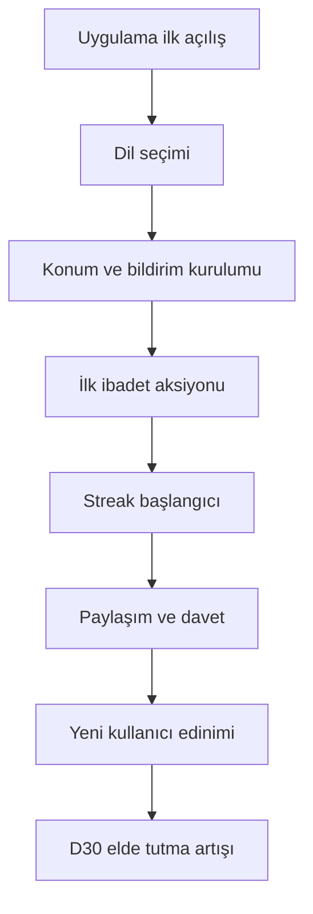

# Huzur Büyüme Planı Türkiye ve Avrupa Diasporası

## Stratejik Çerçeve
- Ana North Star: D30 elde tutma oranı
- Destek KPI: D1 elde tutma, D7 elde tutma, ilk hafta 3 ibadet aksiyonu tamamlama oranı, paylaşım başına yeni kullanıcı oranı
- Pazar yaklaşımı: Türkçe ağırlıklı çift dil deneyimi

## Segmentler
- Türkiye yerel kullanıcı
- Avrupa diasporası Türkçe öncelikli kullanıcı
- Avrupa diasporası Türkçe artı İngilizce kullanıcı

## Ürünü Nasıl Şekillendirmelisiniz

### 1. Aktivasyon
- İlk açılışta dil seçimi akışı
  - Türkçe önerisi
  - İngilizce ikincil seçenek
- İlk oturumda tek bir güçlü değer gösterimi
  - Namaz vakti ve bildirim kurulumu
  - Hemen ardından kişisel hedef seçimi
- Üç adımlı hızlı başlangıç
  - Konum ayarı
  - Bildirim izni
  - İlk ibadet aksiyonu

### 2. Retention Motoru
- Streak sistemi merkezde konumlansın
- Kaçırma önleme akışı
  - Uyarı
  - Esnek telafi
  - Geri kazanım görevi
- Bildirim stratejisi
  - Türkiye için yerel namaz ritmi
  - Avrupa diasporası için saat dilimi duyarlı gönderim

### 3. Viral Büyüme
- Paylaşılabilir içerik kartları
  - Günün duası
  - Günün ayeti
  - Streak başarısı
- Davet akışı
  - Arkadaşını davet et
  - Davet sonrası ortak hedef
- Referans mekanizması
  - Davet eden ve gelen için içerik kilidi açma

### 4. İçerik Büyümesi
- Dönemsel editoryal takvim
  - Cuma
  - Kandil
  - Ramazan
- Türkiye ve diaspora için içerik varyantları
  - Metin tonu
  - Bildirim zamanı
  - Kampanya mesajı

### 5. Premium Konumlandırma
- Büyüme odakta premium sert duvar değil değer artırıcı duvar olsun
- Ücretsiz tarafta günlük alışkanlık kurduran çekirdek akış korunmalı
- Premium faydalar daha çok derinleşme odaklı sunulmalı

## Öncelikli Ürün Kaldıraçları
1. Kişiselleştirilmiş onboarding
2. Streak ve geri kazanım akışı
3. Paylaşılabilir içerik ve davet döngüsü

## Ölçüm Planı
- Zorunlu event seti
  - onboarding_started
  - onboarding_completed
  - first_prayer_action_completed
  - streak_day_incremented
  - reminder_opened
  - content_shared
  - invite_sent
  - invite_accepted
  - day_30_retained
- Dashboard kesitleri
  - Ülke bazlı
  - Dil bazlı
  - Kanal bazlı edinim

## 2026-02 Faz Growth Hardening Tamamlama Notu

- Quiet hours kuralı notification tercihlerine ve scheduler katmanına entegre edildi.
- Push copy varyant deneyi (A/B/C) runtime deterministik atama ile aktif edildi.
- Home içinde uygulama içi growth funnel paneli eklendi.
- Dönemsel campaign resolver (Cuma, Kandil, Ramazan, evergreen) ve diaspora varyantı aktif edildi.
- Referral/invite campaign parametreleri aktif campaign bağlamıyla üretilecek şekilde güncellendi.
- Regresyon kontrolleri başarılı:
  - lint
  - build:ci
  - cap sync android
  - android assembleDebug

## Uygulama Fazları

### Faz 1 Temel Büyüme Altyapısı
- Çift dil onboarding
- İlk değer anı optimizasyonu
- Event şeması ve dashboard kurulumu

### Faz 2 Retention Derinleştirme
- Streak detay ekranı
- Kaçırma önleme ve geri kazanım
- Bildirim kişiselleştirme

### Faz 3 Viral ve İçerik Ölçekleme
- Paylaşım kartları
- Davet referans akışı
- Dönemsel içerik motoru

## Mermaid Akış

## Code Modu İçin Detaylı Backlog

### Faz 1 0-30 Gün

#### Epic A Aktivasyon ve Onboarding
- Story A1 TR ve EN dil seçim ekranı
  - Kabul kriteri: İlk açılışta dil seçimi zorunlu
  - Kabul kriteri: Seçim [`src/i18n.js`](src/i18n.js) üstünden kalıcı saklanır
- Story A2 Hızlı başlangıç 3 adım
  - Kabul kriteri: Konum izni akışı tamamlanır
  - Kabul kriteri: Bildirim izni akışı tamamlanır
  - Kabul kriteri: İlk ibadet aksiyonuna yönlendirme yapılır
- Story A3 İlk değer anı kartı
  - Kabul kriteri: Kullanıcı ilk oturumda namaz vakti kartını görür
  - Kabul kriteri: Karttan bildirim aktivasyonu tek tıkla yapılır

#### Epic B Ölçüm Altyapısı
- Story B1 Event şema implementasyonu
  - Eventler: onboarding_started, onboarding_completed, first_prayer_action_completed
  - Kabul kriteri: Event parametrelerinde locale, country, timezone zorunlu
- Story B2 Dashboard temel paneller
  - Kabul kriteri: D1 D7 D30 retention paneli hazır
  - Kabul kriteri: TR ve diaspora kırılımı görünür
- Story B3 Funnel raporu
  - Kabul kriteri: Onboarding adım düşüşleri raporlanır

#### Epic C Bildirim Temeli
- Story C1 Saat dilimi duyarlı gönderim
  - Kabul kriteri: Türkiye ve Avrupa için farklı gönderim penceresi
- Story C2 Sessiz saat kuralı
  - Kabul kriteri: Kullanıcı sessiz saat tanımlayabilir

### Faz 2 31-60 Gün

#### Epic D Retention Motoru
- Story D1 Streak çekirdek sistemi
  - Kabul kriteri: Günlük ibadet tamamlandığında streak artar
  - Kabul kriteri: [`src/features/lifestyle/StreakFeature.jsx`](src/features/lifestyle/StreakFeature.jsx) üstünde görünür
- Story D2 Streak recovery akışı
  - Kabul kriteri: Kaçırılan gün sonrası 24 saatlik telafi görevi
  - Kabul kriteri: Modal ve görev ekranı açılır
- Story D3 Haftalık hedef sistemi
  - Kabul kriteri: Haftalık 3 ve 5 hedef paketi seçilebilir

#### Epic E Kişiselleştirme
- Story E1 Kullanıcı niyet seçimi
  - Kabul kriteri: Kuran odaklı, namaz odaklı, alışkanlık odaklı segment seçilir
- Story E2 Dinamik ana sayfa sıralaması
  - Kabul kriteri: Segmente göre içerik kart sırası değişir

#### Epic F İçerik Takvimi Motoru
- Story F1 Dönemsel içerik etiketleme
  - Kabul kriteri: Cuma, kandil, Ramazan tag yapısı aktif
- Story F2 Diaspora zamanlama varyantı
  - Kabul kriteri: Avrupa saatlerine göre içerik yayını

### Faz 3 61-90 Gün

#### Epic G Viral Döngü
- Story G1 Paylaşım kartları
  - Kabul kriteri: Günün ayeti, günün duası, streak başarısı görsel kart üretir
- Story G2 Davet akışı
  - Kabul kriteri: Kullanıcı davet linki üretir ve paylaşır
- Story G3 Referans ödül sistemi
  - Kabul kriteri: Davet eden ve gelen için içerik kilidi açılır

#### Epic H Büyüme Deneyleri
- Story H1 A B test altyapısı
  - Kabul kriteri: Onboarding başlıkları test edilebilir
- Story H2 Push metin optimizasyonu
  - Kabul kriteri: En az 3 metin varyantı canlı testte
- Story H3 Paylaşım CTA optimizasyonu
  - Kabul kriteri: Kart bazlı dönüşüm oranı panelde görünür

## Bağımlılıklar
- Analytics servis katmanı: [`src/services/analyticsService.js`](src/services/analyticsService.js)
- Bildirim servis katmanı: [`src/services/reminderService.js`](src/services/reminderService.js)
- Pro kural katmanı: [`src/services/proService.js`](src/services/proService.js)
- Onboarding ve init context: [`src/context/appInitContext.js`](src/context/appInitContext.js)

## Code Moduna Geçiş Planı
1. Faz 1 backlogu sprintlere böl
2. Event şema ve dashboard işlerini ilk sprintte zorunlu tut
3. Her sprint sonunda D1 ve D7 etkisini ölç
4. Faz 2 geçiş kriteri olarak onboarding completion ve D7 eşiklerini kullan
5. Faz 3 geçişte viral katsayı ve D30 trendini kontrol et

## Hazır Implementasyon Sırası
1. A1, A2, B1
2. A3, B2, C1
3. C2, B3
4. D1, D2
5. E1, E2, F1
6. F2, G1
7. G2, G3, H1
8. H2, H3

## Code Modu İçin Backlog Taslağı
- Onboarding ekranları için çift dil metin altyapısı
- Streak recovery modal akış kuralları
- Paylaşım kartı bileşenleri
- Davet ve referans veri modeli
- Analytics event izleme katmanı
- D30 retention dashboard sorguları
