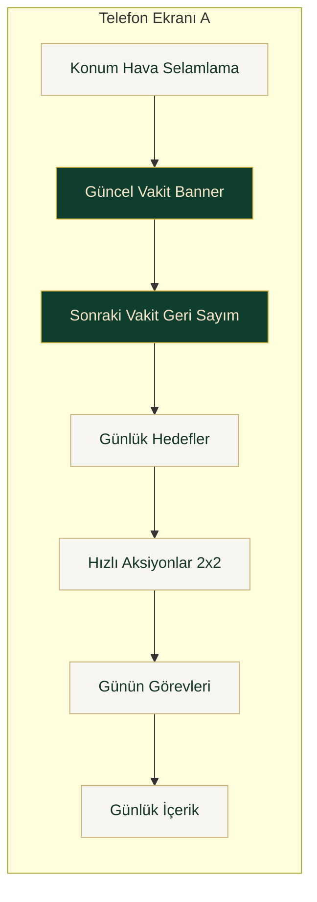
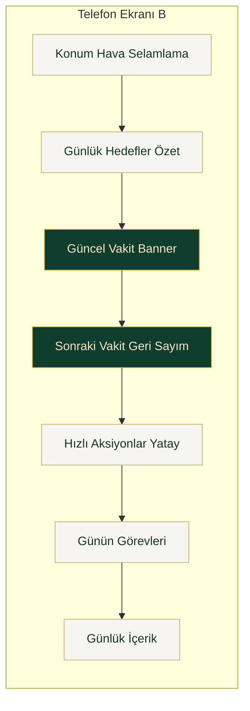
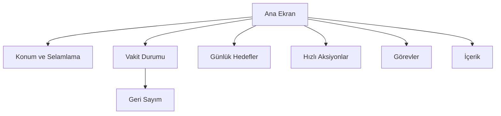

# Ana Ekran Mockup Planı - Sade ve İbadet Odaklı

## 1. Tasarım İlkeleri
- Birincil odak: namaz vakti ve sıradaki vakit
- İkincil odak: günlük ibadet ilerlemesi ve hızlı aksiyon
- Üçüncül odak: içerik ve keşif
- Analitik kartları son kullanıcı ana ekranında yer almaz

## 2. Bilgi Mimarisi Önceliği
1. Vakit durumu
2. Geri sayım
3. Günlük hedefler ve görevler
4. Hızlı ibadet araçları
5. İçerik önerileri

## 2.1 Görsel Mockup A - Vakit Merkezli



## 2.2 Görsel Mockup B - Görev Merkezli



## 3. Mockup A - Vakit Merkezli Akış

```text
┌─────────────────────────────────────┐
│  Konum + Hava + Selamlama          │
├─────────────────────────────────────┤
│  Güncel Vakit Banner               │
│  Örn İkindi Vakti                  │
├─────────────────────────────────────┤
│  Sonraki Vakit Geri Sayım          │
│  01:24:18                          │
│  Alt satır: Günün tüm vakit şeridi │
├─────────────────────────────────────┤
│  Günlük Hedefler Kartı             │
│  - Namaz tamamlandı 3/5            │
│  - Zikir hedefi 120/300            │
│  - Bugün hatim 2 sayfa             │
├─────────────────────────────────────┤
│  Hızlı Aksiyonlar 2x2              │
│  [Namaz Takip] [Zikirmatik]        │
│  [Kıble]      [Günün Duası]        │
├─────────────────────────────────────┤
│  Günün Görevleri                   │
├─────────────────────────────────────┤
│  Günlük İçerik Önerisi             │
└─────────────────────────────────────┘
```

## 4. Mockup B - Görev Merkezli Akış

```text
┌─────────────────────────────────────┐
│  Konum + Hava + Selamlama          │
├─────────────────────────────────────┤
│  Günlük Hedefler Kartı             │
│  Bugün özeti tek bakışta           │
├─────────────────────────────────────┤
│  Güncel Vakit Banner               │
├─────────────────────────────────────┤
│  Sonraki Vakit Geri Sayım          │
├─────────────────────────────────────┤
│  Hızlı Aksiyonlar yatay çipler      │
│  Namaz  Zikir  Kıble  Dua          │
├─────────────────────────────────────┤
│  Günün Görevleri                   │
├─────────────────────────────────────┤
│  Günlük İçerik                      │
└─────────────────────────────────────┘
```

## 5. Akış Diyagramı



## 6. Mevcut Bileşenlerden Uygulanabilir Eşleme
- Üst blok aynı kalır: [`HomeHeader`](src/components/HomeHeader.jsx)
- Vakit başlığı aynı kalır: [`PrayerTimeBanner`](src/components/PrayerTimeBanner.jsx)
- Geri sayım aynı kalır: [`PrayerCountdown`](src/components/PrayerCountdown.jsx)
- Görev bölümü korunur: [`DailyQuests`](src/components/DailyQuests.jsx)
- İçerik bölümü korunur: [`DailyContentGrid`](src/components/app-shell/AppHomeTabContent.jsx:85)
- Hızlı aksiyon için mevcut grid sadeleştirilir: [`FeatureGrid`](src/components/FeatureGrid.jsx)
- Yerleşim sırası düzenlenecek dosya: [`AppHomeTabContent()`](src/components/app-shell/AppHomeTabContent.jsx:18)

## 7. Karar Notu
- Son kullanıcı deneyimi için önerim Mockup A
- Sebep: namaz odaklı uygulamada en kritik karar anı olan sonraki vakit bilgisi üstte ve görünür
- Growth kartı ana ekranda olmayacak, gerekirse sadece admin veya debug görünümünde tutulacak
