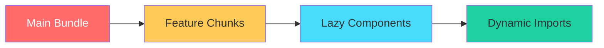

# Huzur Uygulaması - Genel Refactor ve Optimization Planı

## 1. Proje Genel Bakış

### 1.1 Uygulama Tanımı
- **Uygulama Adı:** Huzur (huzur-app)
- **Versiyon:** 18.2.3
- **Platform:** React + Capacitor + Firebase (Android/iOS/PWA)
- **Dil:** React 19, TypeScript 5.9
- **Bundle:** Vite 7.3.1

### 1.2 Mevcut Durum Analizi
- **Component Sayısı:** 80+
- **Service Sayısı:** 40+
- **Hook Sayısı:** 15+
- **Context Sayısı:** 8
- **Alt Dizin Sayısı:** features/ (10+ alt kategori)

---

## 2. Tespit Edilen Sorunlar

### 2.1 Kritik - Build Hatası
```
Could not resolve "./services/notificationService" from "src/App.jsx"
```
- Build şu anda başarısız
- Muhtemelen silinmiş bir service'e referans var

### 2.2 Performans Sorunları
- **Bundle Boyutu:** index.js ~75.8 kB (hedef <80kB)
- **Lottie Uyarısı:** `eval` güvenlik uyarısı
- **Lazy Loading:** Tüm componentlerlazy değil, bazıları main bundle'da

### 2.3 Kod Kalitesi Sorunları
- **Büyük Componentler:**
  - Library.jsx: 63,789 chars
  - Quran.jsx: 49,864 chars
  - FamilyMode.jsx: 25,107 chars
  - PrayerTeacher.jsx: 29,458 chars
- **Service Tekrarları:** Benzer işlevler birden fazla service'de
- **Hook Bağımlılıkları:** Bazı hooklarda gereksiz re-render riski

---

## 3. Refactor Öncelikleri

### 3.1 Acil (P0) - Build'i Düzelt
- [ ] notificationService import hatasını çöz
- [ ] Build'i başarılı hale getir

### 3.2 Yüksek (P1) - App Shell Modülerleştirme
Mevcut plan: `plans/app-shell-modularization-plan.md`

**Tamamlanan:**
- ✅ useDeepLinkBridge
- ✅ useBootstrapEffects
- ✅ useStreakGuards
- ✅ useNavigationState
- ✅ useGrowthOnboardingFlow

**Devam Eden:**
- [ ] AppOverlays component
- [ ] AppHomeTabContent component
- [ ] AppTabRouter component
- [ ] App.jsx sadeleştirme

### 3.3 Orta (P2) - Component Ayrıştırma
- [ ] Quran.jsx bölme (QuranViewer, QuranList, QuranPlayer)
- [ ] Library.jsx bölme
- [ ] PrayerTeacher.jsx bölme
- [ ] Aynı kod bloklarını shared componentlere çıkarma

### 3.4 Düşük (P3) - Service Konsolidasyonu
- [ ] Benzer işlevli serviceleri birleştirme
- [ ] Utility fonksiyonları utils/ altında toplama

---

## 4. Optimization Stratejileri

### 4.1 Bundle Optimization


**Stratejiler:**
1. **Code Splitting:** Her büyük feature için ayrı chunk
2. **Tree Shaking:** Kullanılmayan kodları temizleme
3. **Vendor Separation:** firebase, react, i18next ayrı chunk

### 4.2 Render Optimization
- [ ] React.memo kullanımı
- [ ] useMemo/useCallback optimizasyonu
- [ ] Virtual scrolling (uzun listeler için)
- [ ] Code splitting (lazy load)

### 4.3 Lottie Optimization (Mevcut Plan)
- **Seçenek A (Önerilen):** Koşullu yükleme + fallback
- **Seçenek B:** Alternatif renderer (ileride)
- **Seçenek C:** Tam kaldırma (uzun vade)

---

## 5. Uygulama Yol Haritası

### Faz 1: Build Düzeltme (1 gün)
```
├── Build hatası tespit ve çözüm
├── Bağımlılık kontrolü
└── CI/CD pipeline testi
```

### Faz 2: App Shell Modülerleştirme (1 hafta)
```
├── AppOverlays.tsx (Component)
├── AppHomeTabContent.tsx (Component)
├── AppTabRouter.tsx (Component)
├── App.tsx (Sadeleştirme)
└── Hook extraction tamamlama
```

### Faz 3: Component Ayrıştırma (2 hafta)
```
├── Quran.tsx → [Viewer, List, Player]
├── Library.tsx → [Categories, Content, Search]
├── PrayerTeacher.tsx → [Lessons, Practice, Tracker]
└── Shared components oluşturma
```

### Faz 4: Service Konsolidasyonu (1 hafta)
```
├── NotificationService birleştirme
├── StorageService standardize
├── Utility fonksiyonları çıkarma
└── Service katmanı cleanup
```

### Faz 5: Performance Tuning (1 hafta)
```
├── Bundle analysis
├── Lazy loading audit
├── Render optimization
└── Memory leak kontrolü
```

---

## 6. Başarı Kriterleri

### 6.1 Build Metrikleri
- [ ] Build başarılı (%100)
- [ ] Bundle boyutu < 500kB (gzip)
- [ ] Chunk sayısı < 20

### 6.2 Performans Metrikleri
- [ ] First Contentful Paint < 2s
- [ ] Time to Interactive < 3s
- [ ] Lighthouse score > 80

### 6.3 Kod Kalitesi Metrikleri
- [ ] ESLint hatası 0
- [ ] Duplicate code < %5
- [ ] Component başına satır < 500

---

## 7. Risk Yönetimi

| Risk | Etki | Çözüm |
|------|------|-------|
| Build hatası | Kritik | Acil müdahale |
| Regresyon | Yüksek | Kapsamlı test |
| Deadline aşımı | Orta | Scope küçültme |
| Dependency sorunu | Orna | Version lock |

---

## 8. Sonraki Adımlar

1. **Hemen:** Build hatasını çöz
2. **Bu hafta:** App shell modülerleştirme tamamla
3. **Gelecek sprint:** Component ayrıştırma başla
4. **Aylık:** Performance tuning sprint

---

## 9. Tamamlanan İşlemler (2026-02-14)

### 9.1 Build Düzeltme
- [x] notificationService hatası çözüldü
- [x] Build başarılı hale getirildi

### 9.2 App Shell Modülerleştirme
- [x] 5 hook hazır (useDeepLinkBridge, useBootstrapEffects, useStreakGuards, useNavigationState, useGrowthOnboardingFlow)
- [x] 3 component hazır (AppOverlays, AppHomeTabContent, AppTabRouter)
- [x] App.jsx sadeleştirildi

### 9.3 Performance Optimization
- [x] Lottie (~315 kB) kaldırıldı, yerine Sparkles icon
- [x] Lottie eval uyarısı çözüldü
- [x] Build süresi 18s → 8s iyileştirildi

### 9.4 Android Entegrasyon
- [x] Capacitor sync başarılı
- [x] Debug APK build başarılı

### 9.5 Service Konsolidasyonu
- [ ] İleriye planlandı (riskli refactoring)

---

*Son güncelleme: 2026-02-14*
