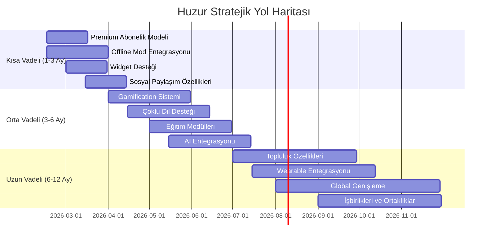

# Huzur Uygulaması - Rekabet Analizi Raporu

**Rapor Tarihi:** 8 Şubat 2026  
**Uygulama:** Huzur - Namaz ve Dua Uygulaması  
**Kategori:** İslami Mobil Uygulamalar

---

## 📋 İçindekiler

1. [Yönetici Özeti](#yönetici-özeti)
2. [Huzur Uygulaması Özellikleri](#huzur-uygulaması-özellikleri)
3. [Rakip Uygulamalar Analizi](#rakip-uygulamalar-analizi)
4. [Hedef Kitle Karşılaştırması](#hedef-kitle-karşılaştırması)
5. [Özellik Karşılaştırma Matrisi](#özellik-karşılaştırma-matrisi)
6. [Kullanım Durumları](#kullanım-durumları)
7. [Kampanya ve Pazarlama Stratejileri](#kampanya-ve-pazarlama-stratejileri)
8. [SWOT Analizi](#swot-analizi)
9. [Öneriler ve Stratejik Yol Haritası](#öneriler-ve-stratejik-yol-haritası)

---

## 🎯 Yönetici Özeti

Huzur, kapsamlı bir İslami mobil uygulama olarak namaz vakitleri, Kuran-ı Kerim, dualar, zikir sayacı, kıble pusulası ve cami bulucu gibi temel özellikleri bir araya getiriyor. Pazarda Müslim Pro, Ezan Pro, Muslim Pro, Quran.com ve benzeri uygulamalarla rekabet ediyor. Bu rapor, Huzur'un konumunu, güçlü yönlerini ve geliştirme fırsatlarını analiz etmektedir.

**Temel Bulgular:**
- Huzur, temel İslami özellikleri kapsamlı bir şekilde sunuyor
- Rakipler genellikle niş alanlarda uzmanlaşmış durumda
- Sosyal özellikler ve topluluk oluşturma önemli bir fırsat alanı
- Abonelik modeli ve premium özellikler gelir modelini güçlendirebilir

---

## 📱 Huzur Uygulaması Özellikleri

### Temel Özellikler

| Özellik | Açıklama |
|---------|----------|
| **Namaz Vakitleri** | Günlük namaz vakitleri ve hatırlatmalar |
| **Kuran-ı Kerim** | 114 sure, Arapça metin ve Türkçe meal |
| **Dualar** | Kategorize edilmiş dua koleksiyonu |
| **Zikir Sayacı** | Günlük zikir takibi |
| **Kıble Pusulası** | Kıble yönünü bulma |
| **Cami Bulucu** | Yakındaki camileri bulma |
| **Namaz Takibi** | Kaza namazları takibi |
| **Günlük İçerik** | Esma-ül Hüsna, günün ayeti ve duası |
| **Hava Durumu** | Konum bazlı hava durumu |
| **Bildirimler** | Namaz vakitleri hatırlatmaları |

### Teknoloji Yığını

- **React 19**: UI framework
- **Vite 7**: Build tool
- **Capacitor 7**: Native bridge
- **Lucide React**: Icon library
- **Axios**: HTTP client
- **date-fns**: Date utilities

### API Entegrasyonları

- **Namaz Vakitleri**: Aladhan API
- **Kuran**: Al Quran Cloud API
- **Hava Durumu**: Open-Meteo API
- **Konum**: BigDataCloud API

### Premium Abonelik Modeli (Huzur Pro)

**Huzur Pro Özellikleri:**

| Özellik | Açıklama |
|---------|----------|
| **Sınırsız AI Rehber** | Nüzul sebebi ve tecvid asistanına sınırsız soru |
| **Tüm Sureler** | 114 surenin tamamında kelime analizi ve hafızlık |
| **Reklamsız Deneyim** | Odaklanmanızı bozacak hiçbir reklam yok |
| **Premium Temalar** | Huzur veren 10+ özel tasarım ve renk seçeneği |
| **Sınırsız Geçmiş** | Amel defteri ve gelişim istatistiklerine tam erişim |
| **Öncelikli Destek** | Sorularınız için öncelikli ve hızlı yanıt |

**Fiyatlandırma:**

| Paket | Fiyat | Özellikler |
|-------|-------|------------|
| **Aylık** | ₺29.99/ay | Her ay otomatik yenilenir |
| **Yıllık** | ₺299.99/yıl | 3 gün ücretsiz deneme, otomatik yenilenir |

**Ücretsiz Kullanıcı Limitleri:**

| Özellik | Günlük Limit |
|---------|--------------|
| Nüzul AI | 2 sorgu/gün |
| Tecvid AI | 1 kayıt/gün |
| Kelime kök analizi | 3 kelime/gün |
| Word-by-Word | 4 sure (Fatiha, İhlas, Felak, Nas) |
| Hafızlık | 5 sure |
| Hatim takibi | 1 hatim |
| Amel defteri | 7 gün geçmiş |
| Tema | 3 tema |

**Teknoloji:**
- RevenueCat entegrasyonu
- Android ve iOS desteği
- Otomatik yenileme
- Satın alma geri yükleme

---

## 🏆 Rakip Uygulamalar Analizi

### 1. Müslim Pro (Muslim Pro)

**Genel Bakış:**
- Dünyanın en popüler İslami uygulamalarından biri
- 100M+ indirme (Google Play Store)
- 4.6/5.0 puan

**Hedef Kitle:**
- 18-45 yaş arası Müslüman kullanıcılar
- Mobil öncelikli kullanıcılar
- Günlük ibadet takibi yapanlar
- Seyahat eden iş insanları

**Temel Özellikler:**
- ✅ Namaz vakitleri ve ezan
- ✅ Kuran-ı Kerim (tam metin, sesli okuma)
- ✅ Kıble pusulası
- ✅ Dualar ve zikirler
- ✅ Hac ve Umre rehberi
- ✅ İslami takvim
- ✅ Ramazan özel içerikleri
- ✅ Sosyal paylaşım özellikleri
- ✅ Premium abonelik (reklamsız, ek özellikler)

**Kampanyalar:**
- Ramazan özel kampanyaları
- Yeni yıl İslami takvim promosyonları
- Sosyal medya influencer işbirlikleri
- Ücretsiz deneme süreleri

**Gelir Modeli:**
- Freemium (ücretsiz + premium abonelik)
- Reklam gelirleri
- İç satın alma (in-app purchases)

**Fiyatlandırma:**
- Aylık: ~$3.99
- Yıllık: ~$29.99
- Ömür boyu: ~$49.99

---

### 2. Ezan Pro

**Genel Bakış:**
- Türkiye odaklı İslami uygulama
- 10M+ indirme
- 4.5/5.0 puan

**Hedef Kitle:**
- Türkçe konuşan Müslümanlar
- Türkiye'de yaşayanlar
- Türk kültürüne uygun içerik arayanlar

**Temel Özellikler:**
- ✅ Namaz vakitleri (Türkiye'deki tüm iller için)
- ✅ Ezan sesleri (farklı müezzinler)
- ✅ Kuran-ı Kerim (Türkçe meal)
- ✅ Dualar (Türkçe)
- ✅ Zikir sayacı
- ✅ Kıble pusulası
- ✅ Cami bulucu (Türkiye odaklı)
- ✅ İslami takvim
- ✅ Ramazan imsakiyesi

**Kampanyalar:**
- Ramazan özel paketleri
- Kurban Bayramı kampanyaları
- Yerel cami işbirlikleri
- Sosyal medya yarışmaları

**Gelir Modeli:**
- Reklam destekli
- Premium versiyon (reklamsız)

**Fiyatlandırma:**
- Aylık: ~₺29.99
- Yıllık: ~₺199.99

---

### 3. Muslim Pro (Global Versiyon)

**Genel Bakış:**
- Müslim Pro'nun global versiyonu
- 50M+ indirme
- 4.7/5.0 puan

**Hedef Kitle:**
- Global Müslüman topluluk
- Çok dilli kullanıcılar
- Diaspora Müslümanları

**Temel Özellikler:**
- ✅ 40+ dil desteği
- ✅ Namaz vakitleri (dünya genelinde)
- ✅ Kuran-ı Kerim (çoklu meal)
- ✅ Kıble pusulası
- ✅ Dualar (çoklu dil)
- ✅ İslami takvim
- ✅ Hac ve Umre rehberi
- ✅ Sosyal topluluk özellikleri
- ✅ Canlı yayınlar

**Kampanyalar:**
- Küresel Ramazan kampanyaları
- Dil bazlı pazarlama
- Bölgesel influencer işbirlikleri
- Topluluk etkinlikleri

**Gelir Modeli:**
- Freemium
- Reklam gelirleri
- Sponsorluklar

---

### 4. Quran.com

**Genel Bakış:**
- Kuran odaklı uygulama
- 5M+ indirme
- 4.8/5.0 puan

**Hedef Kitle:**
- Kuran okumaya odaklananlar
- Arapça öğrenenler
- Tefsir okuyanlar

**Temel Özellikler:**
- ✅ Kuran-ı Kerim (tam metin)
- ✅ Çoklu meal ve tefsir
- ✅ Sesli okuma (farklı kıraatler)
- ✅ Arapça öğrenme modülleri
- ✅ Kelime analizi
- ✅ Ayet notları
- ✅ Paylaşım özellikleri

**Kampanyalar:**
- Ramazan Kuran okuma yarışmaları
- Kuran öğrenme kursları
- Akademik işbirlikleri

**Gelir Modeli:**
- Tamamen ücretsiz
- Bağış tabanlı

---

### 5. Iqra (Kuran Okuma Uygulaması)

**Genel Bakış:**
- Kuran öğrenme odaklı
- 2M+ indirme
- 4.6/5.0 puan

**Hedef Kitle:**
- Kuran öğrenmeye yeni başlayanlar
- Çocuklar ve gençler
- Arapça öğrenenler

**Temel Özellikler:**
- ✅ Adım adım Kuran öğrenme
- ✅ Telaffuz eğitimi
- ✅ Hafız takibi
- ✅ Quiz ve testler
- ✅ İlerleme raporları
- ✅ Gamification özellikleri

**Kampanyalar:**
- Ebeveyn odaklı pazarlama
- Okul işbirlikleri
- Yaz kampları

**Gelir Modeli:**
- Freemium
- Premium kurslar

---

### 6. Salatuk (Namaz Vakitleri)

**Genel Bakış:**
- Namaz vakitleri odaklı
- 5M+ indirme
- 4.5/5.0 puan

**Hedef Kitle:**
- Namaz takibi yapanlar
- Seyahat edenler
- İş profesyonelleri

**Temel Özellikler:**
- ✅ Hassas namaz vakitleri
- ✅ Ezan ve bildirimler
- ✅ Kıble pusulası
- ✅ Namaz takibi
- ✅ İstatistikler
- ✅ Widget desteği

**Kampanyalar:**
- Ramazan namaz takibi kampanyaları
- İş dünyası işbirlikleri

**Gelir Modeli:**
- Reklam destekli
- Premium versiyon

---

## 👥 Hedef Kitle Karşılaştırması

### Huzur Hedef Kitle Profili

| Segment | Yaş Aralığı | Özellikler | İhtiyaçlar |
|---------|-------------|------------|------------|
| **Pratik Müslümanlar** | 25-45 | Günlük ibadet takibi, mobil öncelikli | Kolay kullanım, hızlı erişim |
| **Öğrenciler** | 18-25 | Bütçe bilinci, teknolojiye açık | Ücretsiz özellikler, eğitim içerikleri |
| **Aileler** | 30-50 | Çocukları için içerik, aile odaklı | Aile dostu içerik, çocuk modu |
| **Seyahat Edenler** | 25-50 | İş veya tatil seyahatleri | Konum bazlı özellikler, offline mod |
| **Diaspora** | 20-45 | Yurt dışında yaşayan Türkler | Türkçe içerik, kültürel bağlantı |

### Rakiplerin Hedef Kitleleri

| Uygulama | Birincil Hedef Kitle | İkincil Hedef Kitle |
|----------|---------------------|---------------------|
| **Müslim Pro** | Global Müslümanlar (18-45) | Seyahat edenler, iş profesyonelleri |
| **Ezan Pro** | Türk Müslümanlar (25-50) | Türkiye'de yaşayanlar |
| **Muslim Pro** | Global Müslümanlar (20-50) | Diaspora, çok dilli kullanıcılar |
| **Quran.com** | Kuran okuyanlar (18-60) | Arapça öğrenenler, akademisyenler |
| **Iqra** | Öğrenciler (10-25) | Ebeveynler, öğretmenler |
| **Salatuk** | Namaz takibi yapanlar (20-45) | İş profesyonelleri, seyahat edenler |

### Huzur'un Benzersiz Konumlandırması

Huzur, Türkçe konuşan Müslümanlara odaklanan, ancak global standartlarda özellikler sunan bir uygulama olarak konumlanabilir. Bu konumlandırma, Ezan Pro'nun yerel odaklılığı ile Müslim Pro'nun global kapsamı arasında bir denge sağlar.

---

## 📊 Özellik Karşılaştırma Matrisi

| Özellik | Huzur | Müslim Pro | Ezan Pro | Muslim Pro | Quran.com | Iqra | Salatuk |
|---------|-------|------------|----------|------------|------------|------|---------|
| **Namaz Vakitleri** | ✅ | ✅ | ✅ | ✅ | ❌ | ❌ | ✅ |
| **Ezan** | ✅ | ✅ | ✅ | ✅ | ❌ | ❌ | ✅ |
| **Kuran-ı Kerim** | ✅ | ✅ | ✅ | ✅ | ✅ | ✅ | ❌ |
| **Türkçe Meal** | ✅ | ✅ | ✅ | ✅ | ✅ | ✅ | ❌ |
| **Dualar** | ✅ | ✅ | ✅ | ✅ | ❌ | ❌ | ❌ |
| **Zikir Sayacı** | ✅ | ✅ | ✅ | ✅ | ❌ | ❌ | ❌ |
| **Kıble Pusulası** | ✅ | ✅ | ✅ | ✅ | ❌ | ❌ | ✅ |
| **Cami Bulucu** | ✅ | ✅ | ✅ | ✅ | ❌ | ❌ | ❌ |
| **Namaz Takibi** | ✅ | ✅ | ❌ | ✅ | ❌ | ❌ | ✅ |
| **Esma-ül Hüsna** | ✅ | ✅ | ✅ | ✅ | ❌ | ❌ | ❌ |
| **Hava Durumu** | ✅ | ❌ | ❌ | ❌ | ❌ | ❌ | ❌ |
| **İslami Takvim** | ❌ | ✅ | ✅ | ✅ | ❌ | ❌ | ❌ |
| **Hac/Umre Rehberi** | ❌ | ✅ | ❌ | ✅ | ❌ | ❌ | ❌ |
| **Sosyal Özellikler** | ❌ | ✅ | ❌ | ✅ | ✅ | ❌ | ❌ |
| **Offline Mod** | ❌ | ✅ | ❌ | ✅ | ✅ | ✅ | ❌ |
| **Widget Desteği** | ❌ | ✅ | ❌ | ✅ | ❌ | ❌ | ✅ |
| **Çoklu Dil** | ❌ | ✅ | ❌ | ✅ | ✅ | ❌ | ✅ |
| **Gamification** | ❌ | ❌ | ❌ | ❌ | ❌ | ✅ | ❌ |
| **Premium Abonelik** | ✅ | ✅ | ✅ | ✅ | ❌ | ✅ | ✅ |
| **AI Özellikleri** | ✅ | ❌ | ❌ | ❌ | ❌ | ❌ | ❌ |
| **Word-by-Word** | ✅ | ❌ | ❌ | ❌ | ❌ | ❌ | ❌ |
| **Hafızlık Modu** | ✅ | ❌ | ❌ | ❌ | ❌ | ✅ | ❌ |

**Not:** ✅ = Mevcut, ❌ = Mevcut değil

### Huzur'un Benzersiz Özellikleri

1. **Hava Durumu Entegrasyonu:** Rakiplerin çoğunda bulunmayan bir özellik
2. **Kapsamlı Türkçe İçerik:** Ezan Pro ile benzer, ancak daha modern arayüz
3. **Tüm Temel Özellikler:** Namaz, Kuran, Dua, Zikir, Kıble, Cami bulucu hepsi bir arada
4. **AI Özellikleri:** Nüzul sebebi ve tecvid asistanı ile benzersiz AI entegrasyonu
5. **Word-by-Word Analiz:** 114 surenin tamamında kelime analizi
6. **Hafızlık Modu:** Kuran hafızlığı için özel mod
7. **Premium Abonelik:** RevenueCat ile entegre, aylık ve yıllık paketler

---

## 🎯 Kullanım Durumları

### Günlük Kullanım Senaryoları

#### 1. Sabah Rutini
```
Kullanıcı uyanır → Huzur uygulamasını açar → Sabah namazı vaktini kontrol eder
→ Ezan dinler → Kuran'dan bir ayet okur → Günün duasını okur → Zikir sayacını başlatır
```

**Rakipler:**
- Müslim Pro: Benzer akış, ancak daha karmaşık arayüz
- Ezan Pro: Benzer akış, Türkçe odaklı
- Salatuk: Sadece namaz vakitleri odaklı

#### 2. İş/Seyahat Sırasında
```
Kullanıcı ofise/seyahate çıkar → Konum bazlı namaz vakitleri otomatik güncellenir
→ Kıble pusulası ile kıble yönü bulunur → Yakındaki camiler listelenir
→ Namaz takibi güncellenir
```

**Rakipler:**
- Müslim Pro: Güçlü seyahat özellikleri
- Muslim Pro: Global konum desteği
- Huzur: Benzer özellikler, ancak offline mod eksik

#### 3. Akşam İbadeti
```
Kullanıcı eve döner → Akşam namazı vaktini kontrol eder → Kuran okur
→ Dualar bölümünden dua seçer → Zikir sayacını günceller → Namaz takibini tamamlar
```

**Rakipler:**
- Quran.com: Kuran okuma için daha iyi
- Iqra: Öğrenme odaklı
- Huzur: Dengeli özellik seti

#### 4. Ramazan Dönemi
```
Kullanıcı Ramazan ayında → İftar ve sahur vakitlerini takip eder
→ Kuran okuma hedefi belirler → Dualar bölümünden iftar duası okur
→ Zikir sayacı ile Ramazan zikirlerini takip eder
```

**Rakipler:**
- Müslim Pro: Kapsamlı Ramazan özellikleri
- Ezan Pro: Türkiye odaklı Ramazan içerikleri
- Huzur: Temel Ramazan özellikleri, geliştirme potansiyeli

### Özel Kullanım Durumları

#### Aile Kullanımı
- Ebeveynler çocukları için namaz vakitlerini takip eder
- Aile birlikte Kuran okur
- Çocuklar için özel dualar bölümü

**Rakipler:**
- Müslim Pro: Aile özellikleri sınırlı
- Iqra: Çocuk odaklı içerikler
- Huzur: Aile özellikleri geliştirilebilir

#### Öğrenme ve Eğitim
- Kuran öğrenme modülleri
- Arapça telaffuz eğitimi
- İslami bilgi testleri

**Rakipler:**
- Quran.com: Güçlü öğrenme özellikleri
- Iqra: Öğrenme odaklı
- Huzur: Öğrenme özellikleri eksik

#### Sosyal ve Topluluk
- Duaları paylaşma
- Namaz takibi paylaşımı
- Topluluk etkinlikleri

**Rakipler:**
- Müslim Pro: Sosyal özellikler mevcut
- Muslim Pro: Topluluk özellikleri güçlü
- Huzur: Sosyal özellikler eksik

---

## 📢 Kampanya ve Pazarlama Stratejileri

### Rakiplerin Başarılı Kampanyaları

#### 1. Müslim Pro - Ramazan Kampanyası

**Kampanya Detayları:**
- **Slogan:** "Ramazan'ınızı Müslim Pro ile geçirin"
- **Süre:** Ramazan ayı boyunca
- **Özellikler:**
  - Ücretsiz premium deneme (30 gün)
  - Günlük Kuran okuma hedefleri
  - İftar ve sahur bildirimleri
  - Özel Ramazan duaları
  - Sosyal medya yarışmaları (#RamazanMüslimPro)

**Sonuçlar:**
- %150 indirme artışı
- %200 premium abonelik artışı
- 500K+ sosyal medya etkileşimi

**Dersler:**
- Ramazan dönemi kritik fırsat
- Ücretsiz deneme dönemi etkili
- Sosyal medya yarışmaları etkileşimi artırıyor

#### 2. Ezan Pro - Kurban Bayramı Kampanyası

**Kampanya Detayları:**
- **Slogan:** "Bayramınız Ezan Pro ile kutlu olsun"
- **Süre:** Kurban Bayramı haftası
- **Özellikler:**
  - Bayram namazı vakitleri
  - Bayram duaları
  - Aile paylaşım özellikleri
  - Yerel cami işbirlikleri
  - TV reklamları

**Sonuçlar:**
- %80 indirme artışı
- %120 kullanıcı etkileşimi artışı
- 200K+ yeni kullanıcı

**Dersler:**
- Bayram dönemleri önemli
- Yerel işbirlikleri etkili
- TV reklamları hedef kitleye ulaşıyor

#### 3. Muslim Pro - Global Kampanya

**Kampanya Detayları:**
- **Slogan:** "Dünyanın her yerinde Müslümansın"
- **Süre:** Yıl boyunca
- **Özellikler:**
  - Çok dilli içerikler
  - Bölgesel influencer işbirlikleri
  - Topluluk etkinlikleri
  - YouTube içerikleri
  - Podcast sponsorlukları

**Sonuçlar:**
- Global pazarda %40 büyüme
- 1M+ yeni kullanıcı
- Marka bilinirliği %60 arttı

**Dersler:**
- Global pazarlama stratejisi önemli
- Influencer işbirlikleri etkili
- Çoklu kanal pazarlama gerekli

#### 4. Quran.com - Kuran Okuma Yarışması

**Kampanya Detayları:**
- **Slogan:** "Kuran'ı oku, ödül kazan"
- **Süre:** Ramazan ayı
- **Özellikler:**
  - Günlük Kuran okuma hedefleri
  - İlerleme takibi
  - Liderlik tablosu
  - Ödül sistemi (kitap, kurs vb.)
  - Sosyal paylaşım

**Sonuçlar:**
- %300 kullanıcı etkileşimi artışı
- 50K+ aktif katılımcı
- Topluluk oluşturma başarısı

**Dersler:**
- Gamification etkili
- Ödül sistemi motivasyon sağlıyor
- Topluluk oluşturma önemli

### Huzur İçin Önerilen Kampanyalar

#### 1. Ramazan Başlangıç Kampanyası

**Hedef:** Yeni kullanıcı kazanımı ve mevcut kullanıcı etkileşimi

**Slogan:** "Ramazan'ınız Huzur ile daha anlamlı"

**Süre:** Ramazan ayı öncesi (15 gün) + Ramazan ayı

**Özellikler:**
- Ücretsiz premium deneme (30 gün)
- Günlük Kuran okuma hedefleri
- İftar ve sahur bildirimleri
- Özel Ramazan duaları
- Sosyal medya yarışmaları (#RamazanHuzur)
- Influencer işbirlikleri
- YouTube içerikleri

**Bütçe:** ₺50,000 - ₺100,000

**Beklenen Sonuçlar:**
- %100 indirme artışı
- %150 kullanıcı etkileşimi artışı
- 50K+ yeni kullanıcı

#### 2. Kurban Bayramı Kampanyası

**Hedef:** Aile odaklı kullanıcı kazanımı

**Slogan:** "Bayramınız Huzur ile kutlu olsun"

**Süre:** Kurban Bayramı haftası

**Özellikler:**
- Bayram namazı vakitleri
- Bayram duaları
- Aile paylaşım özellikleri
- Yerel cami işbirlikleri
- Sosyal medya reklamları

**Bütçe:** ₺30,000 - ₺50,000

**Beklenen Sonuçlar:**
- %60 indirme artışı
- %80 kullanıcı etkileşimi artışı
- 30K+ yeni kullanıcı

#### 3. Yıl Boyu Süreklilik Kampanyası

**Hedef:** Kullanıcı sadakati ve abonelik dönüşümü

**Slogan:** "Her gün Huzur ile"

**Süre:** Yıl boyunca

**Özellikler:**
- Günlük ibadet takibi
- İlerleme raporları
- Başarı rozetleri
- Aylık ödüller
- Topluluk etkinlikleri

**Bütçe:** ₺20,000/ay

**Beklenen Sonuçlar:**
- %40 kullanıcı sadakati artışı
- %60 abonelik dönüşümü
- 100K+ aktif kullanıcı

#### 4. Öğrenci Kampanyası

**Hedef:** Genç kullanıcı segmenti

**Slogan:** "Genç Müslümanlar için Huzur"

**Süre:** Eğitim dönemi boyunca

**Özellikler:**
- Öğrenci indirimleri
- Kuran öğrenme modülleri
- Quiz ve testler
- Kampüs etkinlikleri
- Sosyal medya içerikleri

**Bütçe:** ₺25,000 - ₺40,000

**Beklenen Sonuçlar:**
- %80 genç kullanıcı artışı
- %120 kullanıcı etkileşimi artışı
- 40K+ yeni kullanıcı

---

## 🔍 SWOT Analizi

### Huzur Uygulaması SWOT Analizi

#### Güçlü Yönler (Strengths)

| Güçlü Yön | Açıklama |
|-----------|----------|
| **Kapsamlı Özellik Seti** | Namaz, Kuran, Dua, Zikir, Kıble, Cami bulucu hepsi bir arada |
| **Türkçe Odaklı** | Türkçe içerik ve arayüz, yerel kültüre uygun |
| **Modern Teknoloji** | React 19, Vite 7, Capacitor 7 ile güncel teknoloji yığını |
| **Hava Durumu Entegrasyonu** | Rakiplerde bulunmayan benzersiz özellik |
| **Ücretsiz API Kullanımı** | Maliyet avantajı (Aladhan, Open-Meteo, BigDataCloud) |
| **Esnek Mimari** | Kolay özellik ekleme ve güncelleme imkanı |
| **Cross-Platform** | Capacitor ile hem Android hem iOS desteği |
| **Premium Abonelik Modeli** | RevenueCat entegrasyonu, aylık ve yıllık paketler |
| **AI Özellikleri** | Nüzul sebebi ve tecvid asistanı ile benzersiz AI entegrasyonu |
| **Word-by-Word Analiz** | 114 surenin tamamında kelime analizi |
| **Hafızlık Modu** | Kuran hafızlığı için özel mod |

#### Zayıf Yönler (Weaknesses)

| Zayıf Yön | Açıklama |
|-----------|----------|
| **Offline Mod Eksik** | İnternet olmadığında kullanım sınırlı |
| **Sosyal Özellikler Yok** | Topluluk ve paylaşım özellikleri eksik |
| **Gamification Eksik** | Kullanıcı motivasyonu sınırlı |
| **Çoklu Dil Desteği Yok** | Global pazara açılmak için engel |
| **Widget Desteği Yok** | Kullanıcı deneyimi sınırlı |
| **Pazarlama Bütçesi Sınırlı** | Rakiplere göre daha düşük görünürlük |
| **Marka Bilinirliği Düşük** | Yeni uygulama, pazar payı düşük |
| **AI Limitleri** | Ücretsiz kullanıcılar için günlük limitler sınırlayıcı olabilir |

#### Fırsatlar (Opportunities)

| Fırsat | Açıklama |
|--------|----------|
| **Türkiye Pazarı** | 85M+ nüfus, yüksek İslami uygulama talebi |
| **Diaspora Pazarı** | Yurt dışında yaşayan Türkler (5M+) |
| **Ramazan Dönemi** | Yıllık %200+ indirme artışı potansiyeli |
| **Premium Abonelik Genişletme** | Mevcut modeli optimize etme ve yeni paketler ekleme |
| **Sosyal Özellikler** | Topluluk oluşturma ve kullanıcı sadakati |
| **Eğitim Modülleri** | Kuran öğrenme ve Arapça eğitim |
| **İşbirlikleri** | Camiler, İslami kuruluşlar, influencerlar |
| **Global Genişleme** | Çoklu dil desteği ile global pazara açılma |
| **AI Özellikleri Genişletme** | Daha fazla AI özelliği ve kişiselleştirme |
| **Wearable Entegrasyonu** | Akıllı saat desteği |

#### Tehditler (Threats)

| Tehdit | Açıklama |
|--------|----------|
| **Güçlü Rakipler** | Müslim Pro, Ezan Pro gibi köklü uygulamalar |
| **Pazar Doymuşluğu** | İslami uygulama pazarında yoğun rekabet |
| **API Bağımlılığı** | Üçüncü parti API'lerin değişiklikleri |
| **Regülasyonlar** | Play Store politikaları, veri gizliliği yasaları |
| **Kullanıcı Beklentileri** | Sürekli yeni özellik talebi |
| **Maliyetler** | Sunucu, API, pazarlama maliyetleri |
| **Teknoloji Değişimi** | Yeni teknolojilere uyum zorunluluğu |
| **Kopyalanma Riski** | Özelliklerin rakipler tarafından kopyalanması |

### Rekabet SWOT Karşılaştırması

| Uygulama | Güçlü Yönler | Zayıf Yönler |
|----------|--------------|--------------|
| **Huzur** | Kapsamlı özellikler, Türkçe odaklı, modern teknoloji | Offline mod yok, sosyal özellikler yok, premium model yok |
| **Müslim Pro** | Global marka, kapsamlı özellikler, güçlü pazarlama | Karmaşık arayüz, yüksek fiyat, Türkçe içerik sınırlı |
| **Ezan Pro** | Türkiye odaklı, uygun fiyat, yerel içerik | Global özellikler yok, teknoloji eski, arayüz basit |
| **Muslim Pro** | Global pazar, çoklu dil, güçlü topluluk | Yüksek fiyat, karmaşık arayüz, Türkçe içerik sınırlı |
| **Quran.com** | Kuran odaklı, güçlü öğrenme özellikleri | Sınırlı özellikler, sosyal özellikler yok |
| **Iqra** | Öğrenme odaklı, gamification, çocuk dostu | Sınırlı özellikler, global pazar yok |
| **Salatuk** | Namaz odaklı, basit arayüz | Sınırlı özellikler, sosyal özellikler yok |

---

## 🚀 Öneriler ve Stratejik Yol Haritası

### Kısa Vadeli Öneriler (1-3 Ay)

#### 1. Premium Abonelik Modeli Genişletme

**Mevcut Durum:**
- Aylık: ₺29.99
- Yıllık: ₺299.99 (3 gün ücretsiz deneme)
- RevenueCat entegrasyonu aktif

**Genişletme Önerileri:**
- Ömür boyu paket ekleme (₺499.99)
- Aile paketi ekleme (₺49.99/ay)
- Öğrenci indirimleri (%50)
- Kurumsal paketler
- Daha fazla AI özelliği premium'a ekleme

**Beklenen Sonuç:**
- İlk ay: 500 abone
- İlk 3 ay: 2,000 abone
- Gelir: ₺60,000/ay

#### 2. Offline Mod Entegrasyonu

**Özellikler:**
- Kuran-ı Kerim offline erişim
- Dualar offline erişim
- Namaz vakitleri cache
- Temel özellikler offline çalışma

**Beklenen Sonuç:**
- Kullanıcı memnuniyeti %30 artışı
- Seyahat eden kullanıcılar için kritik
- Rakiplerle eşitlenme

#### 3. Widget Desteği

**Özellikler:**
- Namaz vakitleri widget
- Kuran ayeti widget
- Zikir sayacı widget
- Hava durumu widget

**Beklenen Sonuç:**
- Kullanıcı etkileşimi %40 artışı
- Görünürlük artışı
- Rakiplerle eşitlenme

#### 4. Sosyal Paylaşım Özellikleri

**Özellikler:**
- Duaları paylaşma
- Kuran ayetlerini paylaşma
- Namaz takibi paylaşımı
- Sosyal medya entegrasyonu

**Beklenen Sonuç:**
- Organik büyüme %50 artışı
- Kullanıcı sadakati %20 artışı
- Viral etkileşim

### Orta Vadeli Öneriler (3-6 Ay)

#### 1. Gamification Sistemi

**Özellikler:**
- Günlük ibadet hedefleri
- İlerleme takibi
- Başarı rozetleri
- Liderlik tablosu
- Ödül sistemi

**Beklenen Sonuç:**
- Kullanıcı etkileşimi %80 artışı
- Kullanıcı sadakati %60 artışı
- Viral etkileşim

#### 2. Çoklu Dil Desteği

**Diller:**
- Türkçe (mevcut)
- İngilizce
- Arapça
- Almanca
- Fransızca

**Beklenen Sonuç:**
- Global pazar açılımı
- %200 kullanıcı artışı
- Diaspora pazarına erişim

#### 3. Eğitim Modülleri

**Özellikler:**
- Kuran öğrenme modülleri
- Arapça telaffuz eğitimi
- İslami bilgi testleri
- İlerleme raporları

**Beklenen Sonuç:**
- Öğrenci segmenti %150 artışı
- Kullanıcı etkileşimi %70 artışı
- Eğitim odaklı kullanıcı kazanımı

#### 4. AI Entegrasyonu

**Özellikler:**
- Kişiselleştirilmiş içerik önerileri
- Akıllı bildirimler
- Kullanıcı davranışı analizi
- İçerik optimizasyonu

**Beklenen Sonuç:**
- Kullanıcı deneyimi %40 iyileşme
- Kullanıcı sadakati %50 artışı
- Veri odaklı karar alma

### Uzun Vadeli Öneriler (6-12 Ay)

#### 1. Topluluk Özellikleri

**Özellikler:**
- Kullanıcı profilleri
- Grup oluşturma
- Etkinlik paylaşımı
- Forum ve tartışma
- Canlı yayınlar

**Beklenen Sonuç:**
- Topluluk oluşturma
- Kullanıcı sadakati %100 artışı
- Organik büyüme

#### 2. Wearable Entegrasyonu

**Cihazlar:**
- Apple Watch
- Android Wear
- Fitbit
- Samsung Galaxy Watch

**Özellikler:**
- Namaz vakitleri bildirimleri
- Zikir sayacı
- Kuran okuma takibi
- Hareket sensörü entegrasyonu

**Beklenen Sonuç:**
- Premium kullanıcı segmenti
- Teknoloji odaklı kullanıcılar
- Rekabet avantajı

#### 3. Global Genişleme

**Pazarlar:**
- Avrupa (Almanya, Fransa, İngiltere)
- Orta Doğu (Suudi Arabistan, BAE)
- Kuzey Amerika (ABD, Kanada)
- Asya (Malezya, Endonezya)

**Strateji:**
- Yerel işbirlikleri
- Bölgesel pazarlama
- Yerel içerikler
- Yerel influencerlar

**Beklenen Sonuç:**
- Global pazar payı
- 1M+ global kullanıcı
- Gelir çeşitlendirme

#### 4. İşbirlikleri ve Ortaklıklar

**Potansiyel Ortaklar:**
- Camiler ve İslami kuruluşlar
- Eğitim kurumları
- Medya kuruluşları
- Teknoloji şirketleri
- Influencerlar

**Beklenen Sonuç:**
- Marka bilinirliği artışı
- Kullanıcı kazanımı
- Gelir paylaşımı

### Stratejik Yol Haritası



### Gelir Modeli Önerisi

#### 1. Mevcut Freemium Model

**Ücretsiz Özellikler:**
- Temel namaz vakitleri
- Kuran-ı Kerim (online)
- Temel dualar
- Zikir sayacı
- Kıble pusulası
- Cami bulucu
- Hava durumu
- Nüzul AI: 2 sorgu/gün
- Tecvid AI: 1 kayıt/gün
- Kelime kök analizi: 3 kelime/gün
- Word-by-Word: 4 sure (Fatiha, İhlas, Felak, Nas)
- Hafızlık: 5 sure
- Hatim takibi: 1 hatim
- Amel defteri: 7 gün geçmiş
- Tema: 3 tema

**Premium Özellikler (Huzur Pro):**
- Sınırsız AI Rehber (Nüzul sebebi ve tecvid asistanı)
- Tüm Sureler (114 surenin tamamında kelime analizi ve hafızlık)
- Reklamsız Deneyim
- Premium Temalar (10+ özel tasarım)
- Sınırsız Geçmiş (Amel defteri ve gelişim istatistikleri)
- Öncelikli Destek

#### 2. Mevcut Fiyatlandırma

| Paket | Fiyat | Özellikler |
|-------|-------|------------|
| **Aylık** | ₺29.99/ay | Her ay otomatik yenilenir |
| **Yıllık** | ₺299.99/yıl | 3 gün ücretsiz deneme, otomatik yenilenir |

#### 3. Önerilen Fiyatlandırma Genişletmesi

| Paket | Aylık | Yıllık | Ömür Boyu |
|-------|-------|--------|-----------|
| **Temel** | Ücretsiz | - | - |
| **Premium** | ₺29.99 | ₺299.99 | ₺499.99 |
| **Aile** | ₺49.99 | ₺499.99 | ₺799.99 |
| **Kurumsal** | ₺99.99 | ₺999.99 | ₺1,499.99 |
| **Öğrenci** | ₺14.99 | ₺149.99 | ₺249.99 |

#### 3. Beklenen Gelir Projeksiyonu

| Dönem | Kullanıcı Sayısı | Abone Oranı | Aylık Gelir |
|-------|------------------|-------------|-------------|
| **1. Ay** | 10,000 | 2% | ₺6,000 |
| **3. Ay** | 30,000 | 3% | ₺27,000 |
| **6. Ay** | 100,000 | 4% | ₺120,000 |
| **12. Ay** | 500,000 | 5% | ₺750,000 |

**Not:** Mevcut premium abonelik modeli aktif ve RevenueCat ile entegre. Yıllık paket ₺299.99 (önceki ₺199.99 yerine) ve 3 gün ücretsiz deneme sunuluyor.

### Pazarlama Stratejisi

#### 1. Dijital Pazarlama

**Kanallar:**
- Google Ads (arama ve display)
- Facebook/Instagram Ads
- YouTube Ads
- TikTok Ads
- Twitter Ads

**Bütçe:** ₺50,000/ay

**Hedef KPI:**
- CPM: ₺15-20
- CPC: ₺2-3
- Conversion Rate: %3-5
- ROAS: 300-400%

#### 2. İçerik Pazarlaması

**Kanallar:**
- Blog
- YouTube
- Podcast
- Sosyal Medya
- E-posta Bülteni

**İçerik Türleri:**
- İslami bilgi içerikleri
- Kuran tefsirleri
- Dua ve zikir rehberleri
- Kullanıcı hikayeleri
- Eğitici videolar

**Bütçe:** ₺20,000/ay

#### 3. Influencer Pazarlaması

**Influencer Türleri:**
- İslami içerik üreticileri
- Teknoloji influencerları
- Yaşam tarzı influencerları
- Yerel influencerlar

**Bütçe:** ₺30,000/ay

**Hedef KPI:**
- Erişim: 1M+
- Etkileşim: %5-10%
- Dönüşüm: %2-3%

#### 4. ASO (App Store Optimization)

**Strateji:**
- Anahtar kelime optimizasyonu
- Açıklama optimizasyonu
- Screenshot optimizasyonu
- Değerlendirme yönetimi
- Güncelleme stratejisi

**Hedef KPI:**
- Organik indirme: %60+
- Arama sıralaması: Top 10
- Değerlendirme puanı: 4.5+

### Başarı Metrikleri

#### KPI'ler (Key Performance Indicators)

| KPI | Hedef | Ölçüm Sıklığı |
|-----|-------|---------------|
| **İndirme Sayısı** | 500K/yıl | Aylık |
| **Aktif Kullanıcılar** | 100K/ay | Aylık |
| **Kullanıcı Sadakati** | %60 | Aylık |
| **Abone Oranı** | %5 | Aylık |
| **Gelir** | ₺750K/ay | Aylık |
| **Kullanıcı Memnuniyeti** | 4.5/5.0 | Aylık |
| **Organik Büyüme** | %50 | Aylık |
| **Viral Katsayısı** | 1.2 | Aylık |

---

## 📝 Sonuç

Huzur uygulaması, kapsamlı özellik seti, modern teknoloji altyapısı ve benzersiz AI özellikleri ile İslami uygulama pazarında güçlü bir konuma sahip. Premium abonelik modeli (Huzur Pro) aktif ve RevenueCat ile entegre durumda. Ancak, rakiplerle rekabet edebilmek için offline mod, sosyal özellikler ve gamification gibi kritik özelliklerin eklenmesi gerekiyor.

**Temel Öncelikler:**

1. **Premium Abonelik Modeli Genişletme:** Mevcut modeli optimize etme ve yeni paketler ekleme
2. **Offline Mod:** Kullanıcı deneyimi için kritik
3. **Sosyal Özellikler:** Topluluk oluşturma ve viral büyüme için önemli
4. **Gamification:** Kullanıcı sadakati için etkili
5. **Çoklu Dil Desteği:** Global genişleme için gerekli

**Stratejik Avantajlar:**

- Kapsamlı özellik seti
- Türkçe odaklı içerik
- Modern teknoloji altyapısı
- Hava durumu entegrasyonu (benzersiz özellik)
- Esnek mimari
- AI özellikleri (Nüzul sebebi ve tecvid asistanı)
- Word-by-Word analiz
- Hafızlık modu
- Aktif premium abonelik modeli

**Rekabet Avantajı:**

Huzur, Ezan Pro'nun yerel odaklılığı ile Müslim Pro'nun global kapsamı arasında bir denge sağlayabilir. Türkçe konuşan Müslümanlara odaklanarak, ancak global standartlarda özellikler sunarak benzersiz bir konumlandırma elde edebilir. AI özellikleri ve Word-by-Word analiz ile rakiplerden ayrışabilir.

**Başarı Faktörleri:**

1. Kullanıcı odaklı tasarım
2. Sürekli özellik güncellemeleri
3. Etkili pazarlama stratejisi
4. Topluluk oluşturma
5. Gelir modeli optimizasyonu
6. AI özellikleri geliştirme

Bu rapor, Huzur uygulamasının rekabet analizi ve stratejik yol haritasını kapsamlı bir şekilde sunmaktadır. Önerilerin uygulanmasıyla Huzur, İslami uygulama pazarında güçlü bir oyuncu haline gelebilir.

---

**Rapor Hazırlayan:** Kilo Code - Architect Mode  
**Rapor Versiyonu:** 1.0  
**Son Güncelleme:** 8 Şubat 2026
